# COMPETITOR_MASTER_AUDIT_2026

Date: 2026-03-16

Execution roadmap: [COMPETITIVE_PRODUCT_EXECUTION_ROADMAP_2026-03-16.md](./COMPETITIVE_PRODUCT_EXECUTION_ROADMAP_2026-03-16.md)

## Scope

This is the single file of truth for InductLite's current visual competitor audit.

- Seed list: existing tracked captures in [../competitors/INDEX.md](../competitors/INDEX.md)
- Live research date: 2026-03-16
- Audit method:
  1. Confirm the current competitor universe from the tracked set plus live market search.
  2. Review each priority competitor's homepage, one feature page, and one solution or role page where available.
  3. Capture local screenshots into `./images/`.
  4. Record purpose, UI insights, worker workflow, and the specific InductLite opportunity.

Exception:

- `Sitemate` feature and system pages were Cloudflare-gated during live capture. That section uses the latest repo capture for visual evidence and is marked as partial live evidence.

## Market Inventory

### Priority Direct and Adjacent Set Audited Here

| Competitor | Category | Why it matters |
| --- | --- | --- |
| 1Breadcrumb / Breadcrumb | Direct | Best current construction-specific visual benchmark for inductions, attendance, and contractor control |
| HammerTech | Direct | Enterprise construction safety and permit-to-work heavyweight |
| SignOnSite | Direct | Strong AU/NZ construction positioning and role-based messaging |
| SiteConnect | Direct | NZ health and safety software with contractor, induction, and form workflows |
| SiteDocs | Direct | Safety documentation and worker orientation platform with contractor focus |
| Sitemate | Direct-adjacent | Broad operations/safety platform used heavily across field teams |
| SaferMe | Direct-adjacent | Site sign-in, QR inductions, and risk tooling with a calmer product tone |
| ThinkSafe | Direct | NZ compliance and reporting platform with lighter visual execution |
| Sine | Adjacent | Contractor, permits, and visitor management from a more enterprise visitor stack |
| EVA Check-in | Adjacent | Check-in, contractor, and orientation flows with strong onboarding polish |
| Site App Pro | Direct | NZ/AU field safety product with inductions, attendance, and construction pages |
| SwipedOn | Adjacent | Contractor and workplace sign-in competitor from visitor-management side |
| Worksite | Direct | NZ site induction alternative with lower-polish but relevant positioning |

### Extended Market Inventory Identified But Not Deep-Captured In This Pass

| Competitor | Category | Note |
| --- | --- | --- |
| Donesafe | Broad EHS suite | Broader enterprise EHS platform; less site-induction-specific |
| Rapid Global | Contractor compliance | Strong contractor management category fit |
| Lucidity | Safety and contractor software | Broader HSEQ stack |
| LinkSafe | Contractor management | Relevant contractor compliance player |
| SafetyBase | Construction safety | Strong UK construction safety presence |
| HazardCo | Trade and residential safety | NZ/AU safety operations overlap |
| Onside | Adjacent workforce/visitor | Strong mobile workforce safety, less construction-induction-specific |
| Altora | Contractor onboarding | More specialised onboarding/compliance niche |
| Checksafe | Safety compliance | Relevant but smaller market footprint |

## Cross-Market Visual Read

| Competitor | Visual density | CTA pattern | Core visual language | Best pattern to steal | Legacy weakness |
| --- | --- | --- | --- | --- | --- |
| 1Breadcrumb | Medium-low | One dominant demo CTA | Industrial clean core | Product-first hero discipline | Slightly austere below the fold |
| HammerTech | Medium-high | Repeated request-demo system | Enterprise trust stack | Conversion rigor for complex compliance | Sales-heavy density |
| SignOnSite | Medium | Book demo + info pack | Modern construction editorial | Strong message framing by role and use case | Post-acquisition split identity |
| SiteConnect | High | Demo-first | Gradient SaaS + floating cards | Modular suite storytelling | Decorative clutter |
| SiteDocs | High | Demo everywhere | Bright campaign-style utility | Clear feature inventory | Builder-era visual noise |
| Sitemate | Medium | Free trial + watch demo | Broad platform dashboard marketing | No-code workflow framing | Construction use case is less focused |
| SaferMe | Medium-low | Trial / sign-up | Calm product seriousness | Restrained safety tone | Lower emotional energy |
| ThinkSafe | Low | Free-trial-first | Functional NZ utility | Simple benefit framing | Builder-era presentation |
| Sine | Medium | Demo + plans | Corporate enterprise visitor stack | Strong permit and contractor packaging | Less construction-native |
| EVA Check-in | Medium | Trial-led | Friendly rounded SaaS | Smooth orientation/check-in onboarding | Less ownable category tone |
| Site App Pro | Medium | Free trial + demo | Clean pragmatic Webflow SaaS | Strong inductions + industry packaging | Feature sprawl |
| SwipedOn | Medium | Trial and quote split | Friendly workplace SaaS | Polished contractor crossover | Not construction-first enough |
| Worksite | Low | Free demo | Minimal legacy utility | Clear use-case plainness | Weak visual sophistication |

## Detailed Feature Audit

## 1Breadcrumb

Pages reviewed:

- Homepage: `https://www.breadcrumb.co/en-au`
- Feature page: `https://www.breadcrumb.co/en-au/product/inductions`
- Solution page: `https://www.breadcrumb.co/en-au/solutions/for-head-contractors`

### Inductions

- Feature Purpose: Moves paper-heavy morning inductions into a mobile-first workflow with competency and approval records.
- UI Insights: Strong split layout, dark green CTA, generous whitespace, and a report-table mockup that immediately says "admin control". It feels operational rather than decorative.
- User Workflow:
  1. Worker receives a link or scans a code before arrival.
  2. Worker completes induction content and submits competency evidence on mobile.
  3. Site admin reviews status in the induction register and clears the person for site.
- InductLite Opportunity: Keep this level of focus, but make the QR-to-complete path even more explicit and visibly faster.

### Head Contractor Control

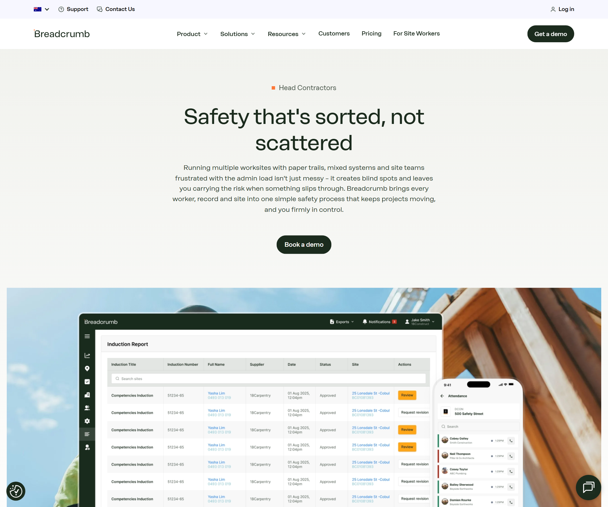

- Feature Purpose: Gives head contractors one place to standardise site rules, supplier compliance, and workforce visibility.
- UI Insights: Role-targeted page structure is excellent. The copy speaks to a buyer type, not just a feature list, and the page holds attention with proof-first hierarchy rather than design tricks.
- User Workflow:
  1. Head contractor configures project requirements and induction rules.
  2. Subcontractors upload documents and complete required pre-start tasks.
  3. Site leadership monitors live compliance and follows up exceptions.
- InductLite Opportunity: Add tighter NZ-specific operational proof and faster setup messaging to outperform the more generic regional framing.

## HammerTech

Pages reviewed:

- Homepage: `https://www.hammertech.com/en-us/`
- Feature page: `https://www.hammertech.com/en-us/construction-orientation-software?hsLang=en-us`
- Solution page: `https://www.hammertech.com/en-us/solutions/contractor-management/permits?hsLang=en-us`

### Construction Orientation

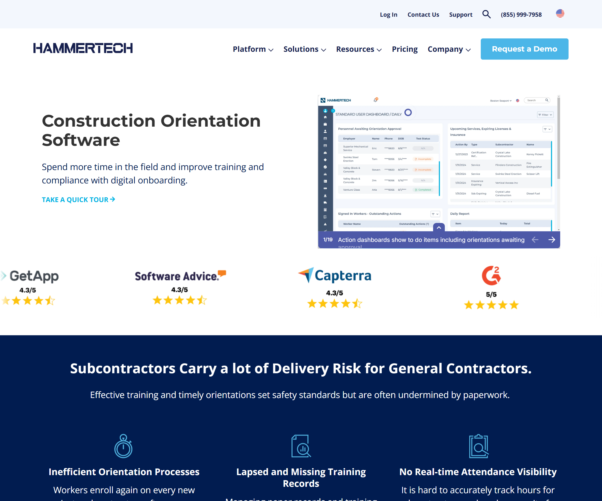

- Feature Purpose: Handles worker orientation before site access so fewer people bottleneck on day one.
- UI Insights: Blue enterprise palette, repeated demo cues, and more proof/supporting copy above the fold. The layout prioritises buyer reassurance over elegance.
- User Workflow:
  1. Worker or subcontractor is invited to complete orientation.
  2. Orientation, documentation, and acknowledgements are submitted remotely.
  3. Site admin validates completion and updates access readiness.
- InductLite Opportunity: Deliver the same trust but with less page weight and a more obviously mobile-first completion path.

### Permits

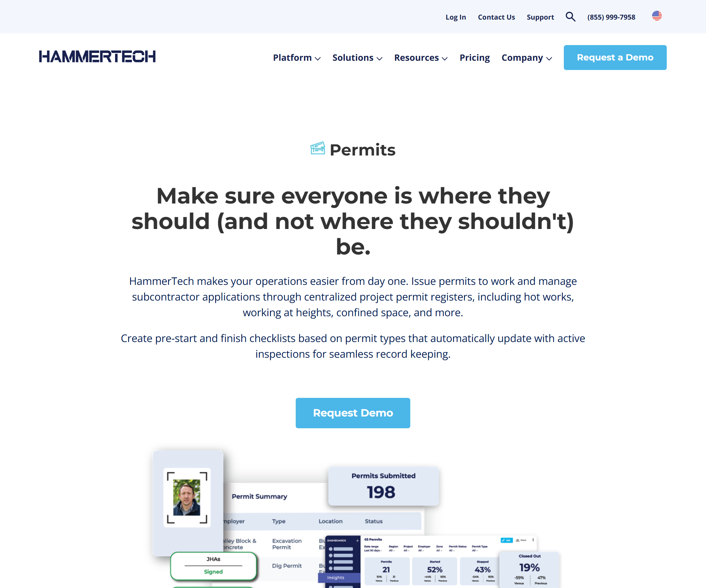

- Feature Purpose: Standardises request, approval, and monitoring for high-risk work permits.
- UI Insights: Good enterprise framing, but the hero remains sales-forward. The page looks competent and expensive, not especially fast.
- User Workflow:
  1. Worker or contractor raises a permit request with site details.
  2. Supervisor reviews conditions and approves or rejects.
  3. Permit status is tracked onsite and closed out after work completes.
- InductLite Opportunity: Show permit status more visually in-progress rather than mainly as a marketing promise.

## SignOnSite

Pages reviewed:

- Homepage: `https://www.signonsite.com/`
- Feature page: `https://www.signonsite.com/product/inductions`
- Solution page: `https://www.signonsite.com/solutions/safety-work-not-paperwork`

### Inductions

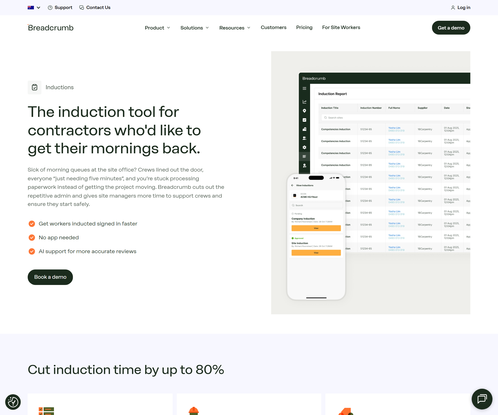

- Feature Purpose: Digital contractor induction and compliance capture.
- UI Insights: The induction URL currently resolves into Breadcrumb branding, which is strategically important. Visually, that means SignOnSite's strongest induction experience is being consolidated into Breadcrumb's cleaner industrial system.
- User Workflow:
  1. Worker starts induction from a site link or admin invitation.
  2. Safety content and checks are completed on a phone.
  3. Completion appears in the admin induction record.
- InductLite Opportunity: The acquisition overlap creates a positioning gap. InductLite can present a more coherent single-brand story than the merged visual experience.

### Safety Work, Not Paperwork

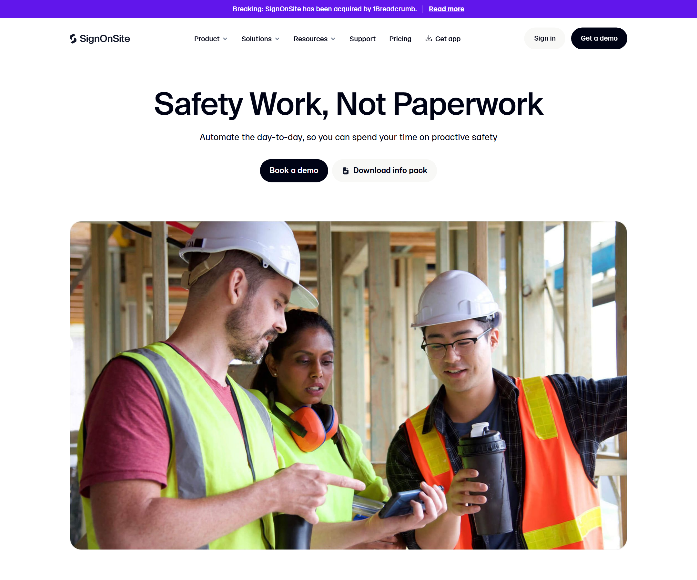

- Feature Purpose: Positions the platform as a day-to-day safety operations layer rather than a static compliance repository.
- UI Insights: Strong message. Dark CTA, secondary download CTA, and a large human photo make it emotionally clear, but the page delays real product proof.
- User Workflow:
  1. Safety manager identifies recurring admin-heavy safety tasks.
  2. The platform digitises inductions, SWMS, permits, and communication flows.
  3. Teams work in the field while leadership monitors progress digitally.
- InductLite Opportunity: Keep the message strength, but bring live UI proof onto the first screen faster.

## SiteConnect

Pages reviewed:

- Homepage: `https://siteconnect.io/`
- Feature page: `https://siteconnect.io/site-induction-software/`
- Solution page: `https://siteconnect.io/construction-safety-management-software/`

### Site Induction Software

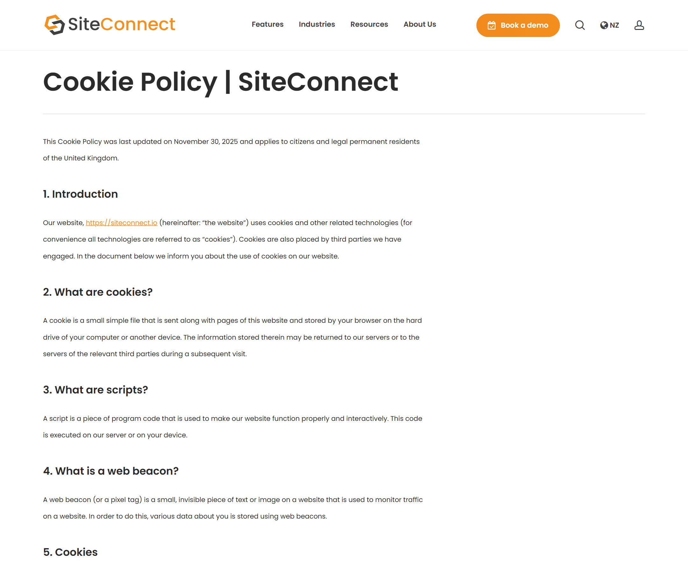

- Feature Purpose: Delivers contractor and visitor induction workflows for site entry and compliance sign-off.
- UI Insights: More decorative than Breadcrumb. Floating cards, gradients, and layered screenshots create energy, but the hierarchy is looser and the CTA competes with visuals.
- User Workflow:
  1. Worker is sent to a digital induction page.
  2. The worker enters details, watches content, and acknowledges requirements.
  3. Completion feeds a site-level compliance record for admin review.
- InductLite Opportunity: Beat SiteConnect by using fewer decorative layers and making the completion flow feel more decisive.

### Construction Safety Management

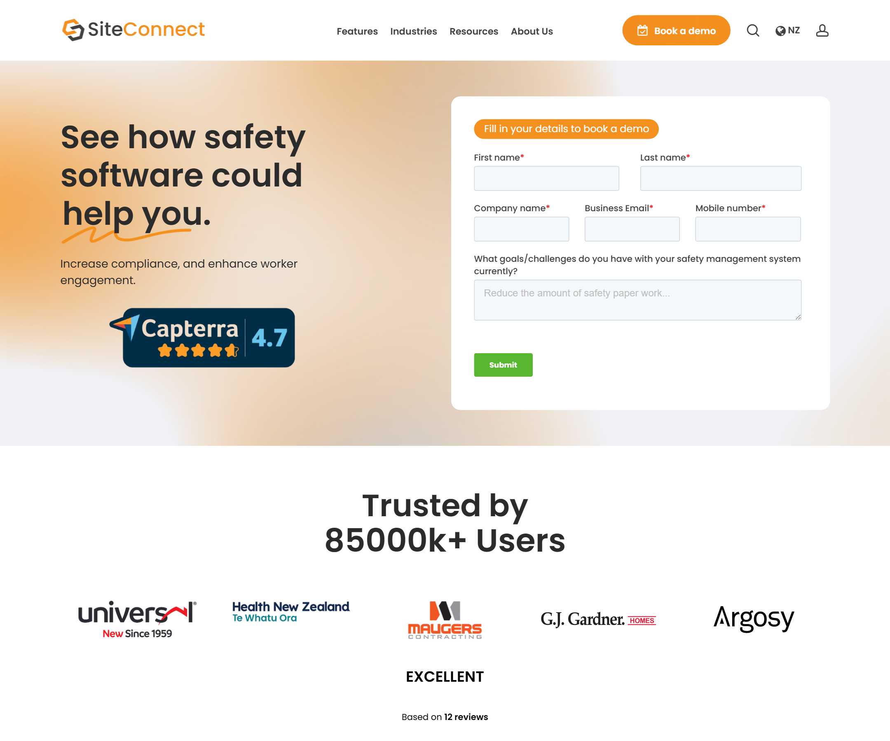

- Feature Purpose: Packages induction, forms, incidents, and contractor workflows into a broader construction safety system.
- UI Insights: This page is strong at suite storytelling. The weakness is density: there are many cards, gradients, and module references before one idea fully lands.
- User Workflow:
  1. Safety leader selects modules needed for a project.
  2. Field teams run inductions, reports, and safety forms from one stack.
  3. Management reviews progress across projects.
- InductLite Opportunity: Present the suite with sharper step-by-step operational narrative instead of a module cloud.

## SiteDocs

Pages reviewed:

- Homepage: `https://www.sitedocs.com/`
- Feature page: `https://www.sitedocs.com/worker-orientation/`
- Solution page: `https://www.sitedocs.com/general-contractors/`

### Worker Orientation

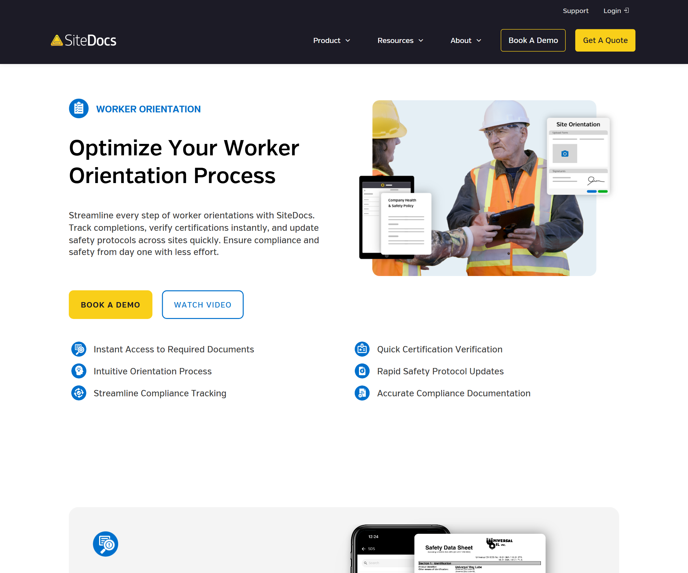

- Feature Purpose: Digitises worker orientation and training acknowledgements for jobsite readiness.
- UI Insights: Very campaign-oriented. Bright accents and Divi-era sectioning make the page loud, but the promise is still understandable. It feels useful, not premium.
- User Workflow:
  1. Worker is assigned orientation content before site arrival.
  2. Worker completes orientation and associated safety checks.
  3. Completion status becomes visible to the site administrator.
- InductLite Opportunity: Offer the same clarity with cleaner typography, fewer decorative colours, and more believable product visuals.

### General Contractors

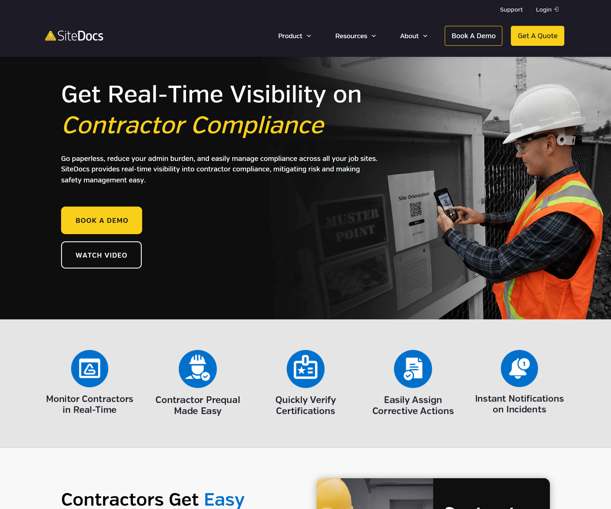

- Feature Purpose: Shows general contractors how SiteDocs supports compliance, forms, and subcontractor control at scale.
- UI Insights: Strong breadth, weak cohesion. The page is effective as a checklist but not memorable as a premium product surface.
- User Workflow:
  1. General contractor standardises forms and site processes.
  2. Subcontractors feed orientation and safety data into the system.
  3. Leadership reviews outstanding issues and documentation status.
- InductLite Opportunity: Keep the breadth but replace the checklist feel with a clearer operating-system story.

## Sitemate

Pages reviewed:

- Homepage: `https://sitemate.com/nz/`
- Attempted live pages: `https://sitemate.com/nz/software/flowsite/`, `https://sitemate.com/nz/systems/safety-management-system/`
- Live capture note: blocked by Cloudflare challenge during this pass
- Visual evidence source: latest tracked repo capture from `competitors/sitemate`

### Platform Hero

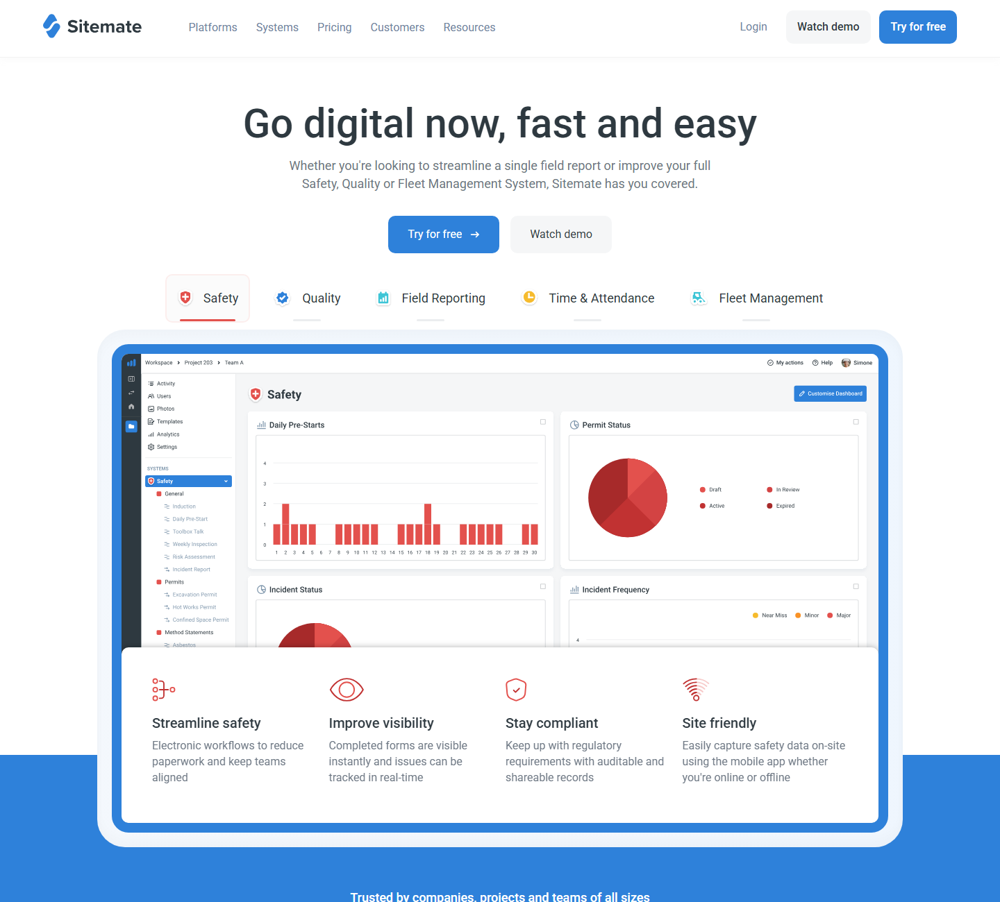

- Feature Purpose: Presents Sitemate as a broad digital operations layer spanning safety, quality, fleet, and field reporting.
- UI Insights: Clear dashboard hero, blue utility palette, and clean top nav. It feels practical and platform-wide, but less tailored to the specific ritual of site induction.
- User Workflow:
  1. Operations lead selects a module family for the business.
  2. Teams digitise forms, reporting, and field workflows.
  3. Managers track output in the dashboard.
- InductLite Opportunity: Stay narrower and stronger. Own the site-entry and compliance ritual instead of selling a generic all-systems platform.

### No-Code Workflow Builder

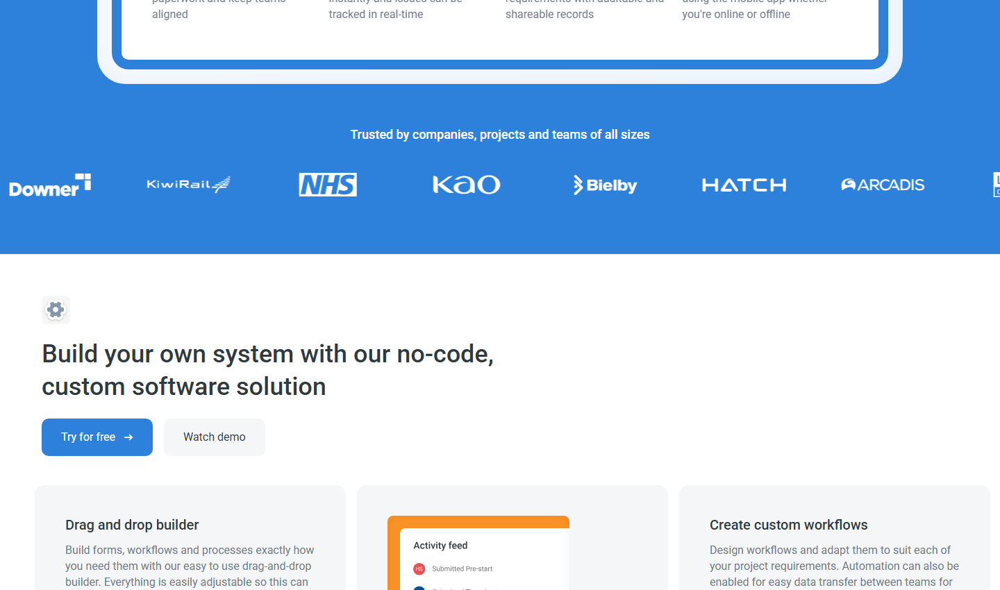

- Feature Purpose: Shows a no-code workflow builder for adapting forms and processes to different projects.
- UI Insights: This is the strongest part of their visual story. The page makes configurability tangible without needing much explanation.
- User Workflow:
  1. Admin drags together a workflow or form process.
  2. The process is assigned to crews or projects.
  3. Submitted data syncs into the wider reporting stack.
- InductLite Opportunity: Borrow the clarity of configurable workflow storytelling, but anchor it to inductions, permits, and live attendance.

## SaferMe

Pages reviewed:

- Homepage: `https://www.safer.me/en-nz/`
- Feature page: `https://www.safer.me/en-nz/features/qr-code-safety-inductions`
- Solution page: `https://www.safer.me/health-safety-consultant/`

### QR Code Safety Inductions

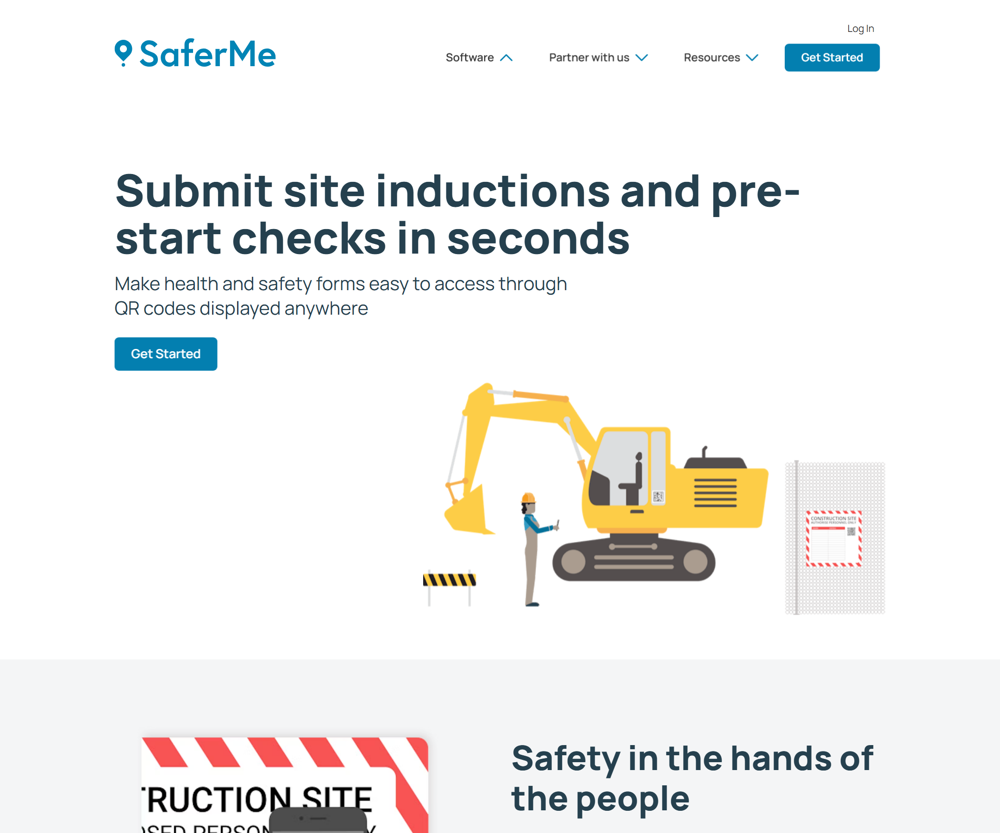

- Feature Purpose: Uses QR entry points to start safety inductions quickly from site.
- UI Insights: Calm teal/blue palette, high restraint, and lower visual noise than most competitors. It feels trustworthy and serious, though not especially bold.
- User Workflow:
  1. Worker scans a QR code at the site.
  2. Worker completes induction and safety checks on mobile.
  3. Site record updates with completion status and safety visibility.
- InductLite Opportunity: Keep the calmness but add stronger urgency and momentum to the first-screen CTA.

### Consultant Layer

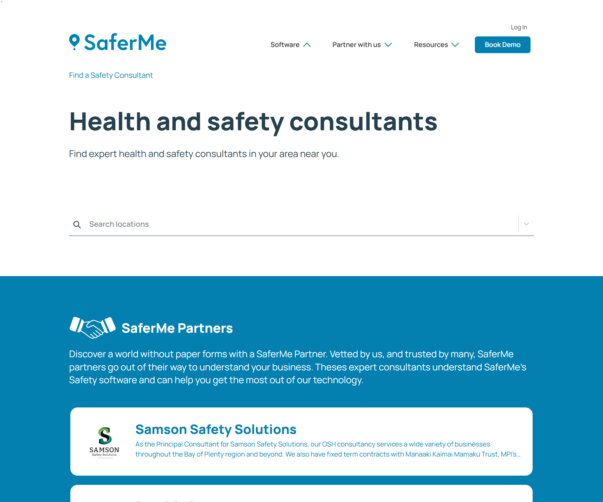

- Feature Purpose: Extends the product story into advisory and consultant-assisted safety operations.
- UI Insights: The visual tone remains composed, but the page feels more service-led than product-led. It is mature, not especially differentiated.
- User Workflow:
  1. Business engages a safety consultant or advisory layer.
  2. Consultant configures safety processes and monitoring.
  3. Field teams execute those processes digitally.
- InductLite Opportunity: Replace consultant-heavy framing with a clearer self-serve site rollout story.

## ThinkSafe

Pages reviewed:

- Homepage: `https://www.thinksafe.co.nz/`
- Feature page: `https://www.thinksafe.co.nz/enterprise-reporting-dashboard/`
- Solution page: `https://www.thinksafe.co.nz/benefits/`

### Enterprise Reporting Dashboard

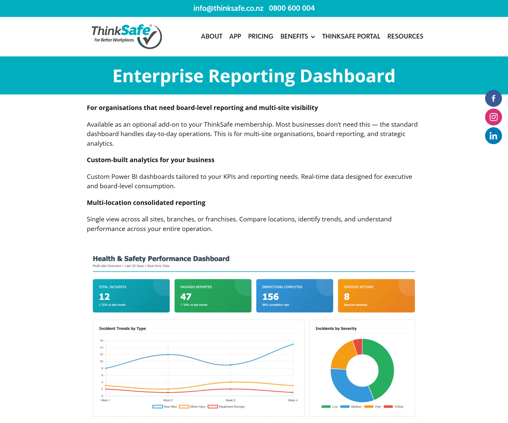

- Feature Purpose: Gives enterprise customers a consolidated reporting and analytics layer over safety/compliance activity.
- UI Insights: Builder-era visual treatment, but the message is direct. The page feels plain and functional, with less polish than the stronger AU competitors.
- User Workflow:
  1. Data is captured across prequal and safety workflows.
  2. Leadership opens the enterprise dashboard.
  3. Risk, completion, and compliance patterns are reviewed centrally.
- InductLite Opportunity: Deliver the same clarity with far stronger dashboard visuals and more real-time site-state cues.

### Benefits Page

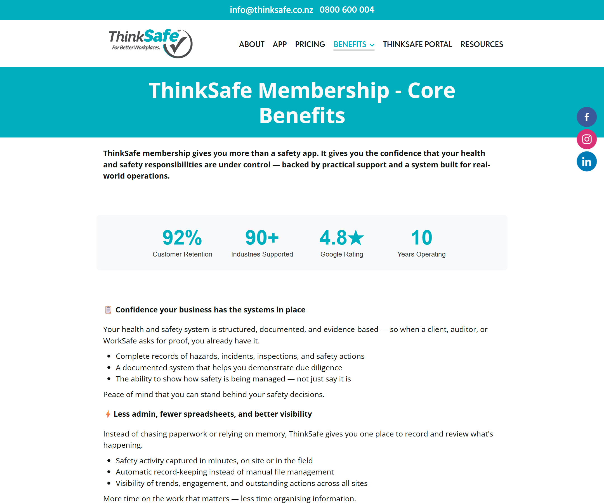

- Feature Purpose: Explains why buyers should choose the platform rather than just what it does.
- UI Insights: Very light visual hierarchy, very little surface sophistication, very plain CTA treatment. It reads as credible but not ambitious.
- User Workflow:
  1. Buyer evaluates operational and compliance pain points.
  2. Buyer reviews benefit statements and support model.
  3. Buyer starts a trial or contacts sales.
- InductLite Opportunity: This is easy ground to beat with better typography, better proof, and stronger product imagery.

## Sine

Pages reviewed:

- Homepage: `https://www.sine.co/`
- Feature page: `https://www.sine.co/contractor/`
- Feature page: `https://www.sine.co/features/permits/`

### Contractor Management

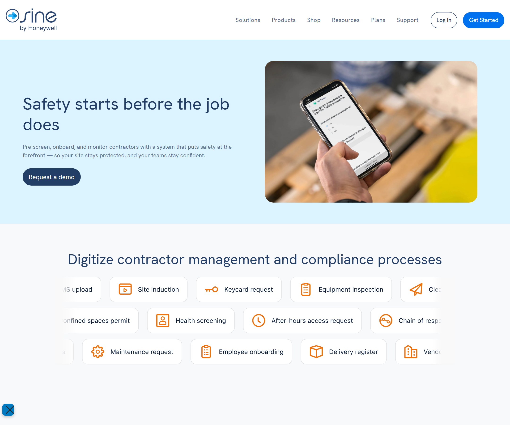

- Feature Purpose: Manages contractor onboarding, access, and compliance from an enterprise visitor-management foundation.
- UI Insights: Corporate, polished, and clearly Honeywell-backed. The design feels bigger-company than construction-native, which builds trust but softens category specificity.
- User Workflow:
  1. Contractor is invited into the platform and submits details.
  2. Required compliance steps and site checks are completed.
  3. The business monitors contractor readiness and site entry status.
- InductLite Opportunity: Outperform Sine by looking more construction-specific and less generic-enterprise.

### Permits

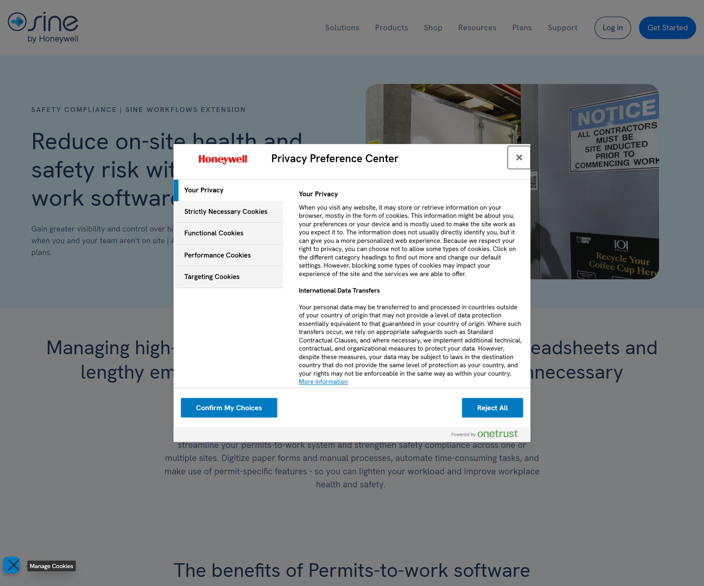

- Feature Purpose: Digitises permit requests and approvals around high-risk work.
- UI Insights: Clean, corporate module page with clear heading and controlled spacing. It is more polished than many direct construction rivals, but emotionally cooler.
- User Workflow:
  1. Worker or contractor submits a work permit.
  2. Approver checks conditions and signs off.
  3. Permit remains visible for active work and audit traceability.
- InductLite Opportunity: Keep the simplicity but make the workflow feel more field-operator-centric and less facility-enterprise.

## EVA Check-in

Pages reviewed:

- Homepage: `https://www.evacheckin.com/`
- Feature page: `https://www.evacheckin.com/health-safety-orientations`
- Solution page: `https://www.evacheckin.com/construction-safety-software`

### Health and Safety Orientations

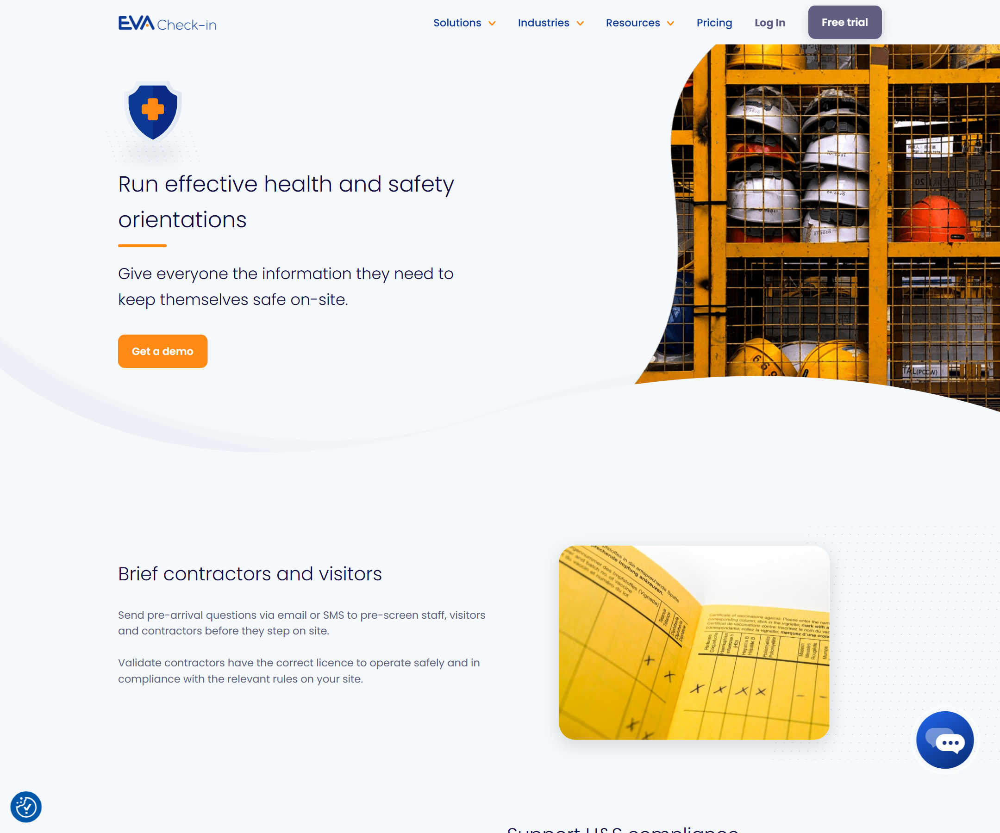

- Feature Purpose: Delivers site or workplace orientations digitally before people enter the environment.
- UI Insights: Friendly colour, rounded shapes, and approachable motion language. The experience feels more onboarding-led than industrial.
- User Workflow:
  1. Visitor or contractor opens an orientation on phone.
  2. Required safety content is completed and acknowledged.
  3. Completion is captured before check-in.
- InductLite Opportunity: Match the friendliness where useful, but apply a more credible construction tone and clearer admin-state visuals.

### Construction Safety Software

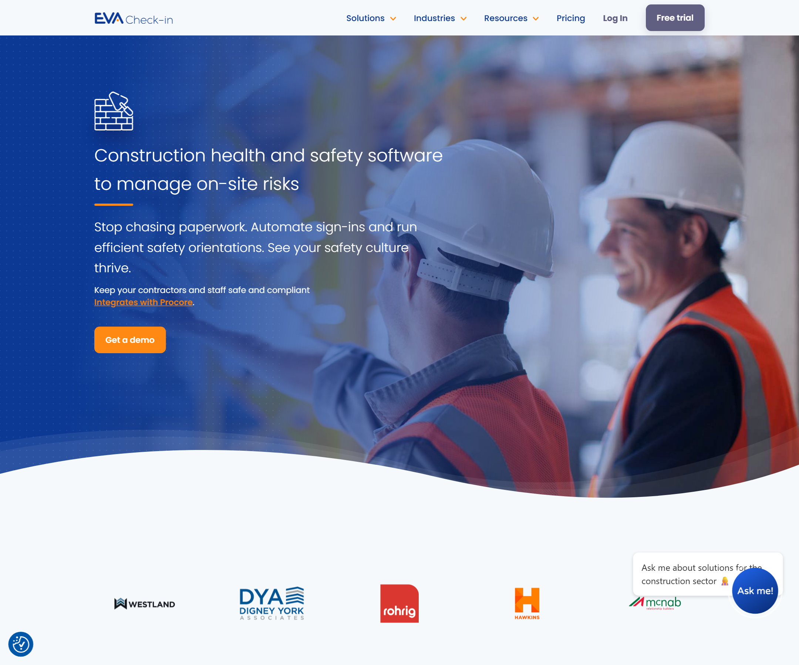

- Feature Purpose: Repositions EVA from visitor check-in into construction-specific health and safety workflows.
- UI Insights: This is a good category crossover page. The tone is conversion-friendly, but it still feels like a visitor-management company expanding into construction rather than being born there.
- User Workflow:
  1. Construction buyer evaluates site sign-in and orientation needs.
  2. EVA frames how one system handles check-ins, hazards, and visitor flow.
  3. Buyer is pushed toward sign-up or demo.
- InductLite Opportunity: Lean harder into construction-native proof than EVA can credibly claim.

## Site App Pro

Pages reviewed:

- Homepage: `https://www.siteapppro.com/`
- Feature page: `https://www.siteapppro.com/features/site-inductions`
- Solution page: `https://www.siteapppro.com/industries/commercial-construction`

### Site Inductions

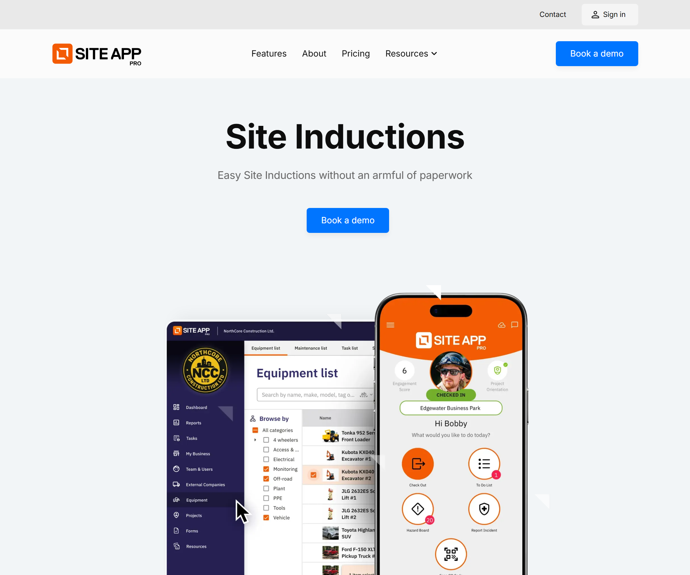

- Feature Purpose: Runs site induction completion and record-keeping digitally for field teams.
- UI Insights: Practical, fairly clean, and more product-led than many NZ peers. Device mockups and short copy blocks keep it understandable without overloading the page.
- User Workflow:
  1. Worker starts induction from a shared site link.
  2. Worker completes induction steps and declarations on device.
  3. Admin reviews completion in the platform.
- InductLite Opportunity: Present richer live-state feedback so the experience feels faster and more modern than static mockups.

### Commercial Construction

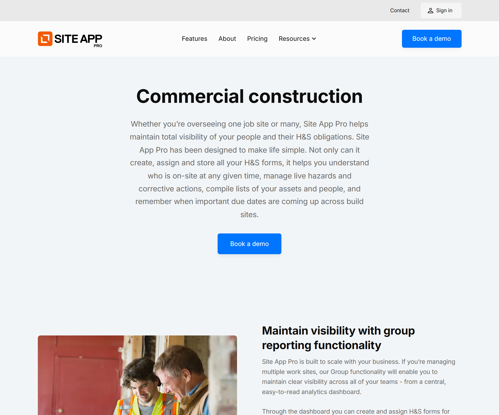

- Feature Purpose: Packages Site App Pro for commercial construction buyers and their daily coordination needs.
- UI Insights: Stronger construction relevance than many adjacent competitors. The page is modular and practical, though still quite list-heavy.
- User Workflow:
  1. Commercial construction buyer reviews industry-fit claims.
  2. Modules like inductions, hazards, and attendance are mapped to the project.
  3. Buyer moves into trial or demo.
- InductLite Opportunity: Replace feature accumulation with a more obvious end-to-end site-entry storyline.

## SwipedOn

Pages reviewed:

- Homepage: `https://www.swipedon.com/`
- Feature page: `https://www.swipedon.com/contractor-management`
- Solution page: `https://www.swipedon.com/construction-and-building`

### Contractor Management

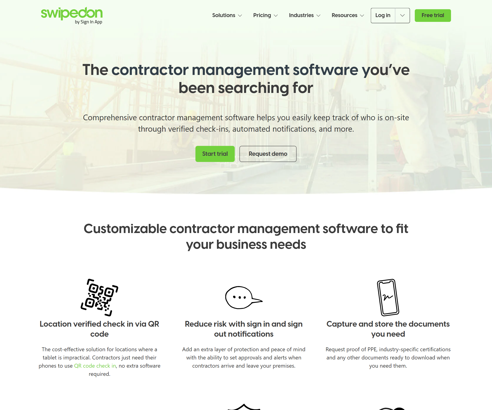

- Feature Purpose: Tracks contractors entering workplaces, their compliance requirements, and repeat visit handling.
- UI Insights: Very polished for an adjacent player. Soft green palette, clean blocks, and simple copy make it feel low-friction, but it is more workplace than worksite.
- User Workflow:
  1. Contractor is pre-registered or signs in on arrival.
  2. Required compliance steps are checked at entry.
  3. Admin sees who is onsite and whether obligations are current.
- InductLite Opportunity: Keep the low-friction polish but go much deeper on actual site induction and permit logic.

### Construction and Building

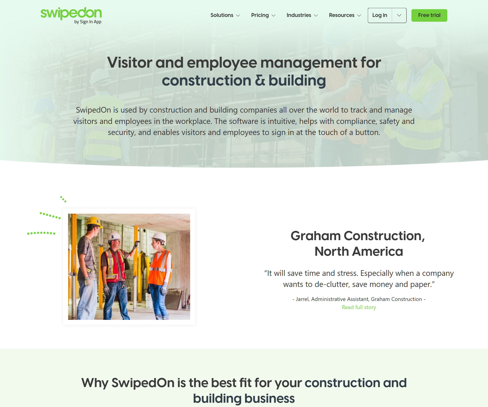

- Feature Purpose: Translates SwipedOn's workplace sign-in product into construction and building language.
- UI Insights: Good industry adaptation, but still clearly a visitor/workplace product being stretched into construction. The UI feels more reception-first than site-first.
- User Workflow:
  1. Construction buyer looks for a sign-in and contractor control tool.
  2. SwipedOn presents contractor, safety, and sign-in benefits.
  3. Buyer is pushed toward quote, demo, or trial.
- InductLite Opportunity: Win by making the product feel born on the gate, not adapted from the lobby.

## Worksite

Pages reviewed:

- Homepage: `https://www.worksite.nz/`
- Feature page: `https://www.worksite.nz/features-and-benefits/`
- Solution page: `https://www.worksite.nz/construction-and-building/`

### Features and Benefits

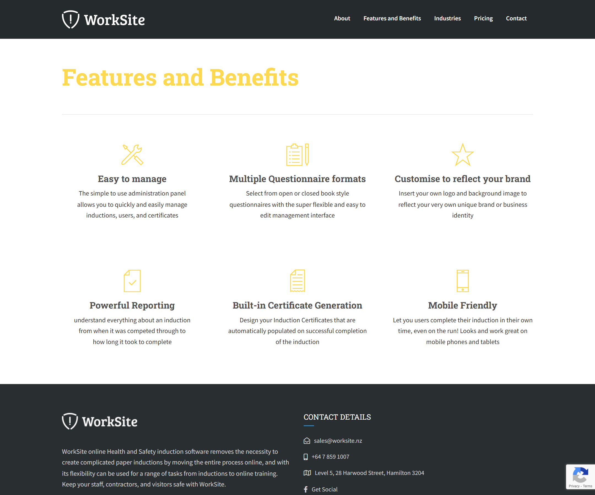

- Feature Purpose: Summarises Worksite's core value as a flexible online induction system.
- UI Insights: Very sparse, builder-era styling, limited product proof, and heavy reliance on plain copy. It is understandable, but visually weak.
- User Workflow:
  1. Buyer reads a simple value statement.
  2. Buyer checks whether inductions can be configured for multiple worksites.
  3. Buyer clicks through to request a demo.
- InductLite Opportunity: Outclass Worksite immediately with better proof, modern typography, and a visible mobile completion flow.

### Construction and Building

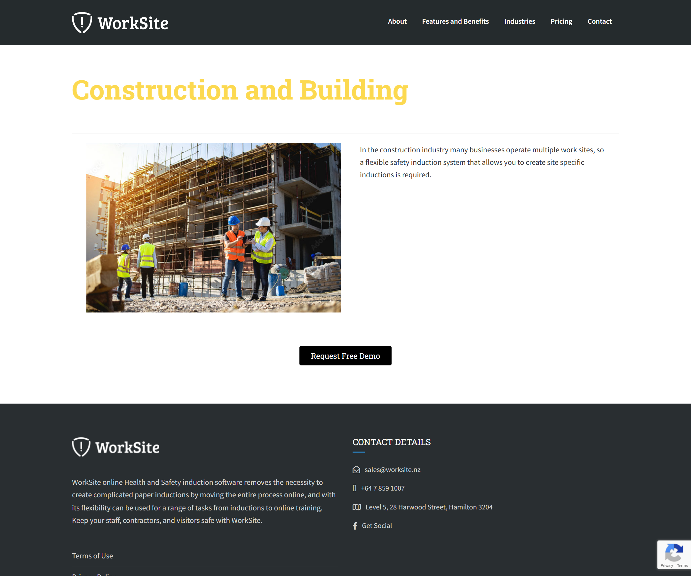

- Feature Purpose: Positions Worksite for construction firms that need site-specific inductions across multiple worksites.
- UI Insights: Direct but minimal. The hero is effectively an image, a paragraph, and a CTA. That simplicity can work, but here it feels underdesigned rather than focused.
- User Workflow:
  1. Construction business evaluates multi-site induction fit.
  2. Buyer sees a brief industry promise and construction image.
  3. Buyer requests a demo for more detail.
- InductLite Opportunity: Preserve the directness, but add much stronger product evidence and operational specificity.

## Strategic Summary

### Visual Density Spectrum

- Lowest density: Worksite, ThinkSafe
- Low-to-medium density: 1Breadcrumb, SaferMe, Site App Pro
- Medium density: SignOnSite, EVA Check-in, Sine, SwipedOn, Sitemate
- Highest density: HammerTech, SiteConnect, SiteDocs

### Patterns Repeated Across The Market

- Almost everyone sells the category with phone or dashboard mockups on the right and copy on the left.
- The best direct competitors use one dominant CTA above the fold, not many equal actions.
- Role and industry packaging is a strong conversion pattern. HammerTech, 1Breadcrumb, SignOnSite, Site App Pro, and SiteDocs all use it well.
- Adjacent visitor-management players feel smoother in onboarding, but weaker in construction credibility.
- NZ incumbents often have functional value but weak visual systems.

### What Competitors Do Better Than InductLite Today

- 1Breadcrumb is still the cleanest at one-path hero hierarchy.
- HammerTech is strongest at making a complex construction buyer feel operationally safe.
- SignOnSite is strong at turning a use case into a memorable headline.
- Sitemate is good at making workflow configurability visible, not abstract.
- EVA Check-in and SwipedOn are smoother at making entry workflows feel easy for first-time users.

### Where InductLite Can Beat The Entire Set

- Show a real QR-to-clearance path faster than anyone else.
- Combine 1Breadcrumb's discipline with better bento storytelling and clearer NZ deployment proof.
- Present live site state, permit state, and induction state more visibly than the static dashboard mockups most competitors rely on.
- Avoid the builder-era clutter common in Worksite, ThinkSafe, SiteDocs, and parts of SiteConnect.
- Avoid the generic enterprise tone that softens Sine and adjacent visitor-management players.

### Recommended Visual Direction For InductLite

- Hero: one dominant action, one softer secondary action, one proof rail
- Product proof: real UI earlier, less stock-photo dependence
- Tone: industrial clean core, not generic SaaS gloss
- Surface system: restrained flat/elevated product panels, not decorative layer stacks
- Story flow: site entry -> induction -> compliance clearance -> live visibility
