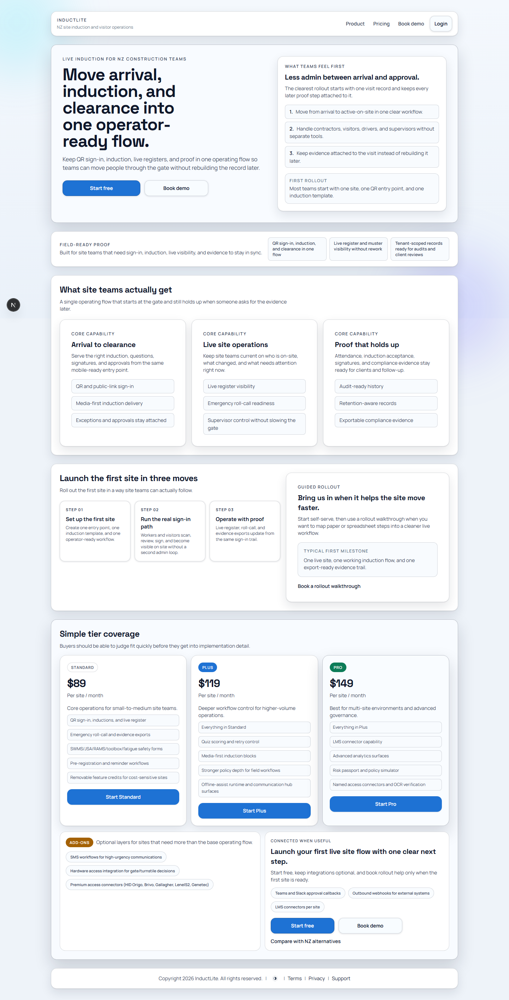
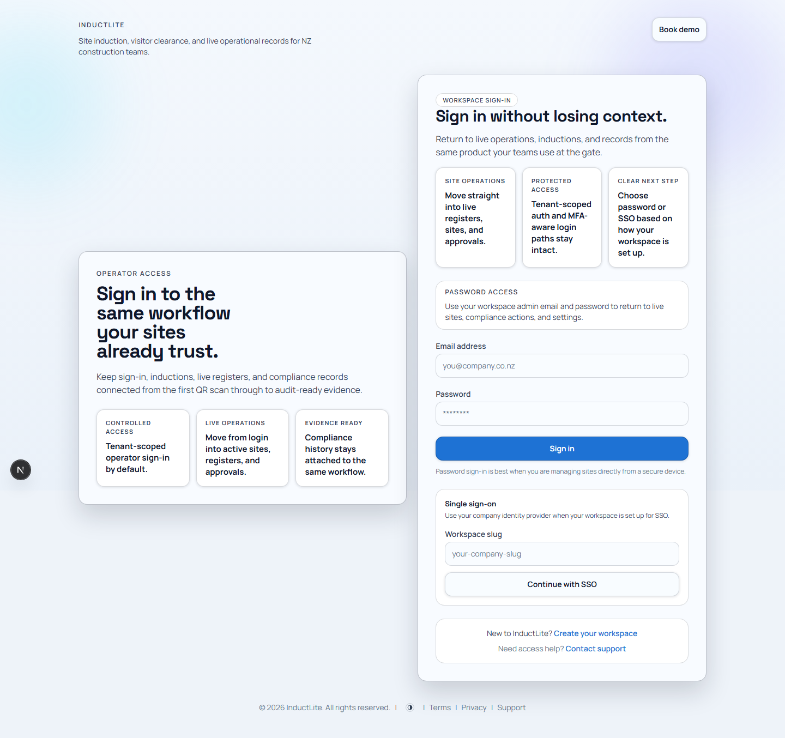
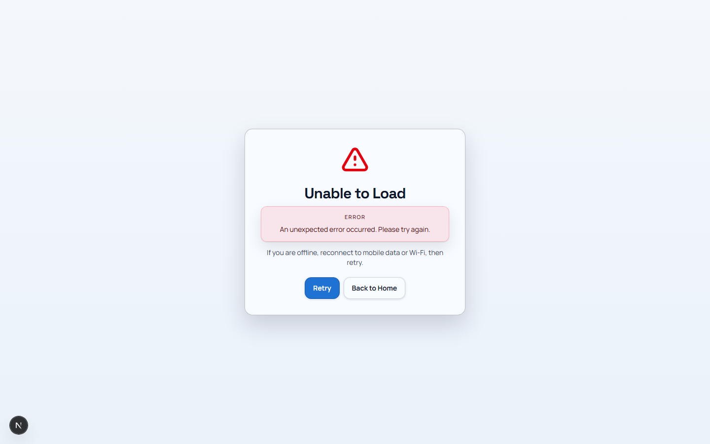

# Feature Guide Phase 1: Public Journey (2026-03-28)

Purpose: explain the first part of InductLite in plain language to someone who does not know the app yet.

This document is written so it can be reused for:

- onboarding
- demos
- partner explanations
- internal walkthroughs
- future tutorial videos

Related documents:

- [FEATURE_BY_FEATURE_EXPLANATION_PLAN_2026-03-28.md](./FEATURE_BY_FEATURE_EXPLANATION_PLAN_2026-03-28.md)
- [APP_TOUR_E2E_CERTIFICATION_PASS_2026-03-28.md](./APP_TOUR_E2E_CERTIFICATION_PASS_2026-03-28.md)

---

## 1. What InductLite Is

### Simple explanation

InductLite is a site access and induction platform for construction and maintenance teams.

It helps a company do three things in one connected workflow:

1. get people signed in at the site
2. make sure they complete the right induction and checks
3. give the admin team a live, auditable record of who is on site, what happened, and what needs attention

### What problem it solves

Without a system like this, site teams often use a mix of:

- paper sign-in sheets
- separate induction forms
- WhatsApp or phone calls for urgent issues
- spreadsheets for contractors and compliance
- manual exports when an audit or incident happens

InductLite pulls those into one operating system.

### Who uses it

There are two main sides:

1. **Public/site users**
   - visitors
   - contractors
   - workers
   - delivery drivers
   - anyone arriving at site

2. **Admin/operators**
   - site admins
   - compliance teams
   - operations managers
   - safety leads
   - company admins

### The simplest way to explain the app to a third person

You can describe it like this:

> InductLite is a construction site operations platform that starts with public sign-in and induction, then carries that information all the way through live site visibility, compliance, approvals, exports, and audit history.

---

## 2. How The Product Flow Starts

The easiest way to explain the app is to start with the first user journey:

1. someone arrives at a site
2. they sign in through a public link or QR flow
3. they complete the required induction steps
4. the system records their presence and status
5. the admin team can immediately see that activity in the admin side

That is why we begin the feature guide with:

1. homepage
2. login
3. public sign-in flow

---

## 3. Feature: Homepage

### What this feature is

The homepage is the product’s public front door. Its job is to explain what the product does and help the right person move into the next step.

### Who uses it

- potential customers
- internal stakeholders
- people invited to evaluate the product
- existing customers looking for login or demo entry points

### When they use it

- when first learning what InductLite is
- when comparing it with other tools
- when deciding whether to book a demo or log in

### Why it matters

This page creates trust and sets the story for the product.

It tells people:

- this is a real operational product
- it handles sign-in, induction, and site records together
- it is not just a form or a visitor log

### What to point out on the page

When explaining the homepage to someone, point out:

1. the top-level message
   - this tells the visitor what the product is for
2. the proof and capability sections
   - this shows the product is for real site operations, not just simple check-in
3. the pricing and product tail
   - this shows how the product is packaged without needing a deep technical discussion
4. the footer controls and links
   - these are supporting elements, not the main story

### Plain-language explanation you can say out loud

> This page introduces InductLite as a product for managing site entry, inductions, and live operational records. It is the marketing and trust layer that gets a customer from “what is this?” to “I want to see a demo or log in.”

### Main use case

The homepage is used to:

- explain the product clearly
- move a prospect into a demo or login path
- create confidence before someone ever sees the admin side

---

## 4. Feature: Login

### What this feature is

The login page is the operator entry point into the admin side of the product.

### Who uses it

- company admins
- site managers
- compliance managers
- operational users returning to live admin workflows

### When they use it

- when they need to access the admin system
- when they are returning to active site operations
- when they want to move from public-facing information into secured admin workflows

### Why it matters

The login page is where the product stops being “marketing” and becomes “real operational software.”

It needs to feel:

- secure
- productized
- connected to the rest of the app
- clear about how to get in

### What to point out on the page

When explaining the login page, point out:

1. password access
   - for direct workspace login
2. SSO access
   - for companies using an identity provider
3. the surrounding product framing
   - it should still feel like the same product as the homepage

### Plain-language explanation you can say out loud

> This is where internal users enter the operating side of the system. It supports both direct login and SSO, and it is designed to feel like a continuation of the product, not a generic auth screen.

### Main use case

The login page is used to move an authenticated internal user into:

- live registers
- site management
- compliance actions
- settings
- history and audit views

---

## 5. Feature: Public Sign-In Flow

### What this feature is

This is the public-facing site entry workflow used by people arriving at a site.

It is the most important frontline experience in the app.

### Who uses it

- contractors
- visitors
- workers
- delivery drivers
- anyone who needs to register their presence on site

### When they use it

- when arriving at a site
- when checking in
- when completing induction steps
- when acknowledging safety requirements before access

### Why it matters

This is where the product proves its value in a real-world moment.

The flow needs to:

- be easy enough for a first-time user
- collect the right information
- present the induction clearly
- create a reliable record for the admin team
- feel trustworthy and professional

### What to point out on the page

When explaining this feature, point out:

1. the guided step structure
   - the flow helps the person move through the required checks in order
2. the induction and acknowledgement sections
   - these are where the system collects compliance evidence
3. the summary and confirmation states
   - these help both the visitor and the site team know what happened
4. the trust and clarity of the layout
   - this route is designed to feel safe and easy under real site conditions

### Plain-language explanation you can say out loud

> This is the site entry workflow used by the person arriving at site. Instead of just signing a paper sheet, they move through a guided digital process that can collect identity details, induction answers, acknowledgements, and access-related information in one flow.

### Main use case

The public sign-in flow is used to:

- register a person’s arrival
- collect required induction/compliance inputs
- produce a clean record for operators
- feed the live register and audit trail

### Real-world example

> A contractor arrives at a site, scans a QR code, enters their details, confirms required declarations, completes the induction questions, and submits. The site team can then immediately see that person in the system instead of relying on a paper sign-in book.

---

## 6. How These Three Features Work Together

These first three features explain the product story in the right order:

1. **Homepage**
   - explains the product
2. **Login**
   - gives operators secure access
3. **Public sign-in flow**
   - shows the real frontline workflow the product is built around

That gives a third person the essential mental model:

- the product starts with site entry
- it supports the public person arriving at site
- and it supports the admin team managing what happens next

---

## 7. Suggested Talk Track For A Third Person

If you want to explain the app simply, you can say:

> InductLite is a site access and induction platform. A person arriving at a site goes through the public sign-in flow, completes the required checks, and becomes visible to the operations team immediately. The homepage explains that story, the login gives staff access to the admin side, and the public sign-in flow is where the actual site-entry experience happens.

---

## 8. What Comes Next

The next feature group to explain is:

- **Operations**

That group includes:

1. Dashboard
2. Sites
3. Pre-Registrations
4. Deliveries
5. Resources
6. Live Register
7. Command Mode
8. Sign-In History
9. Audit Analytics
10. Exports

After the full feature-by-feature pack is complete, we should come back to the deferred external certification follow-up:

- real Procore sandbox certification
- real iOS/Android wrapper/device certification

