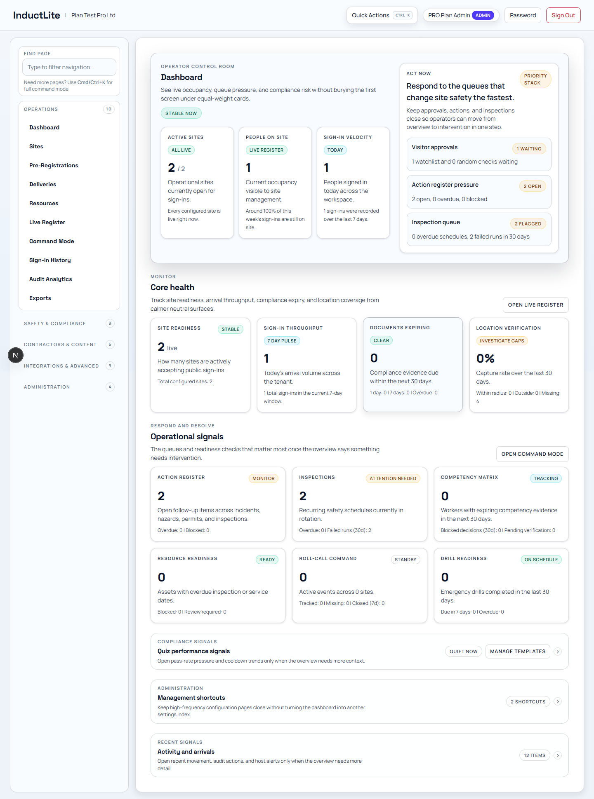
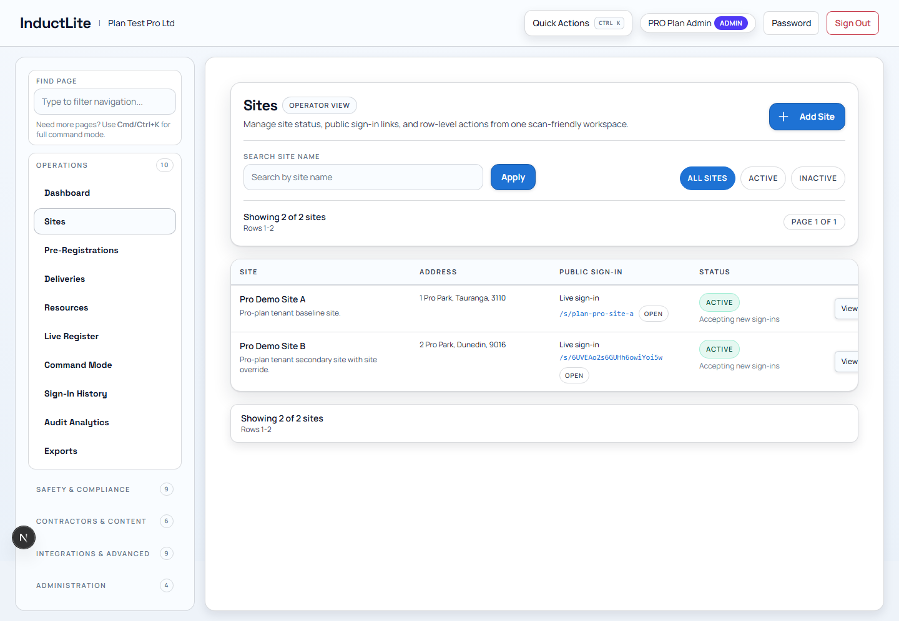
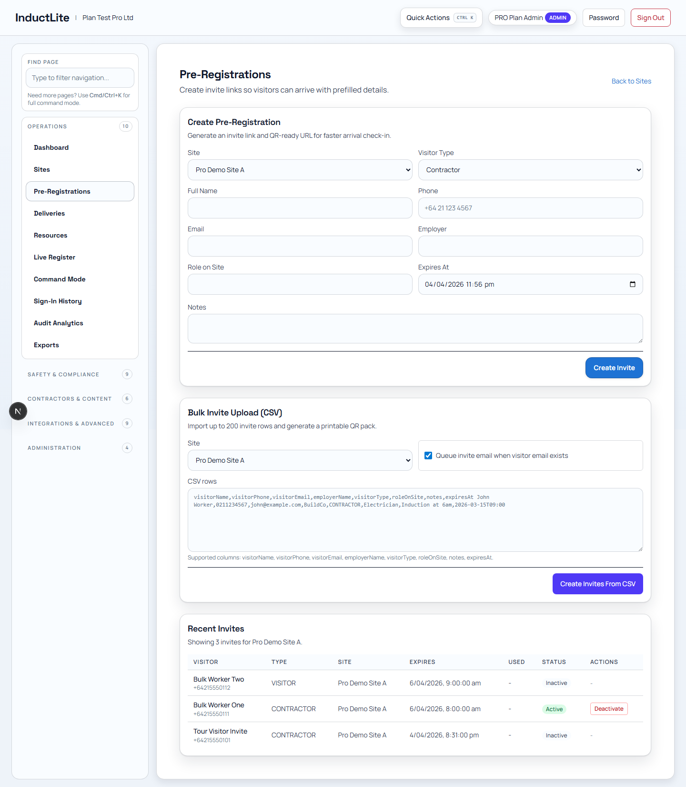
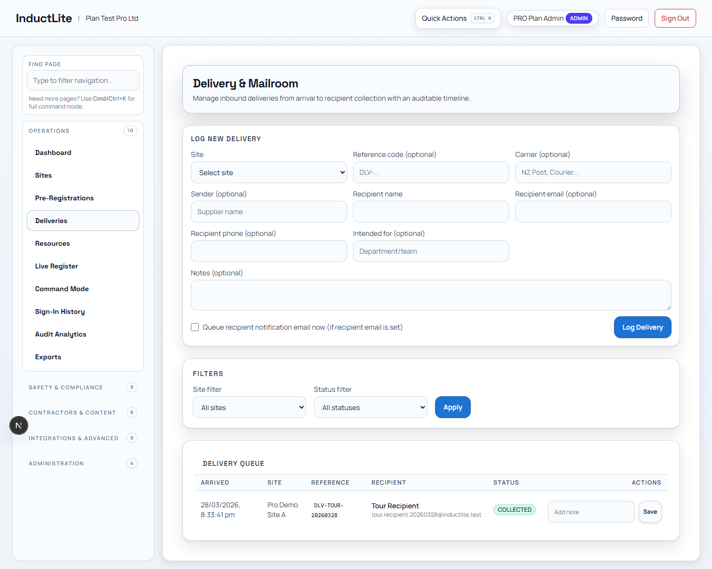
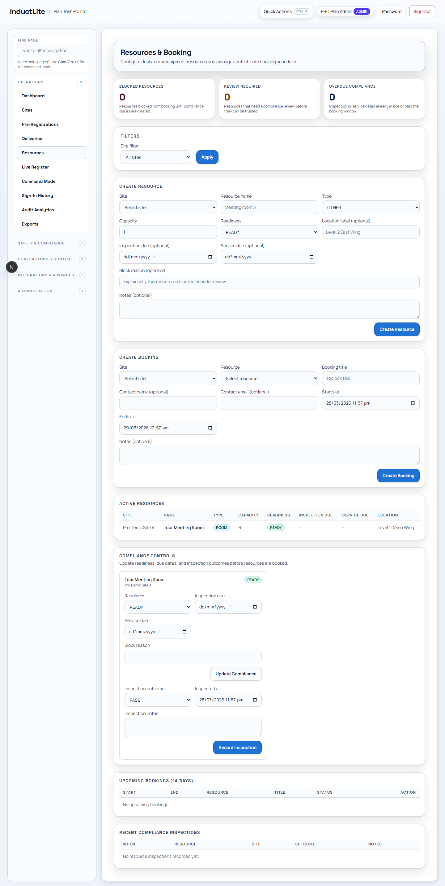
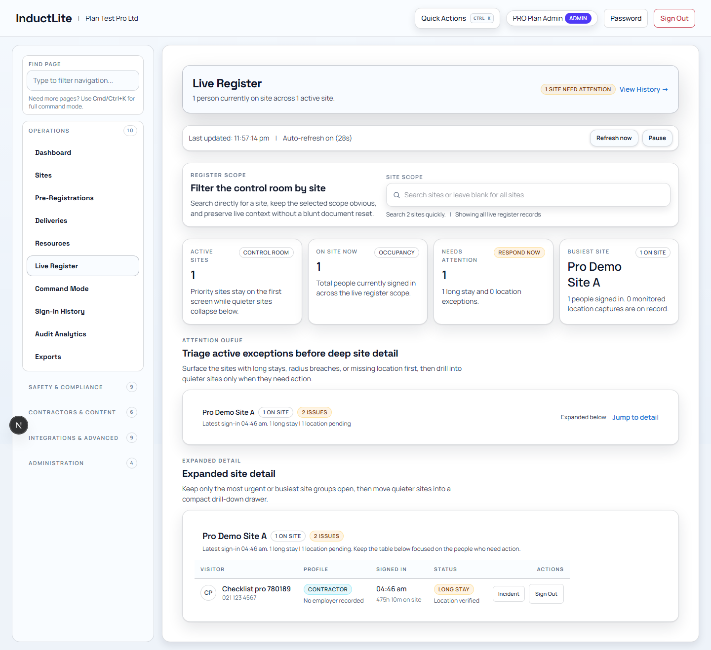
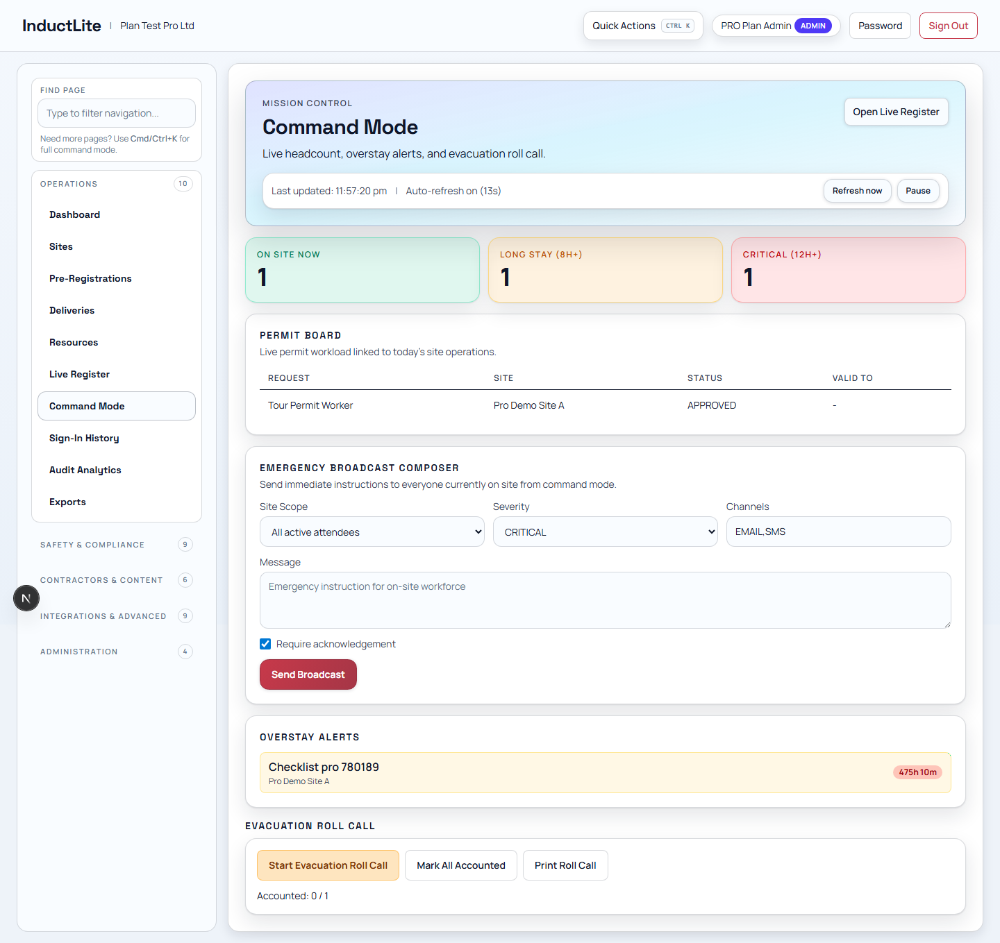
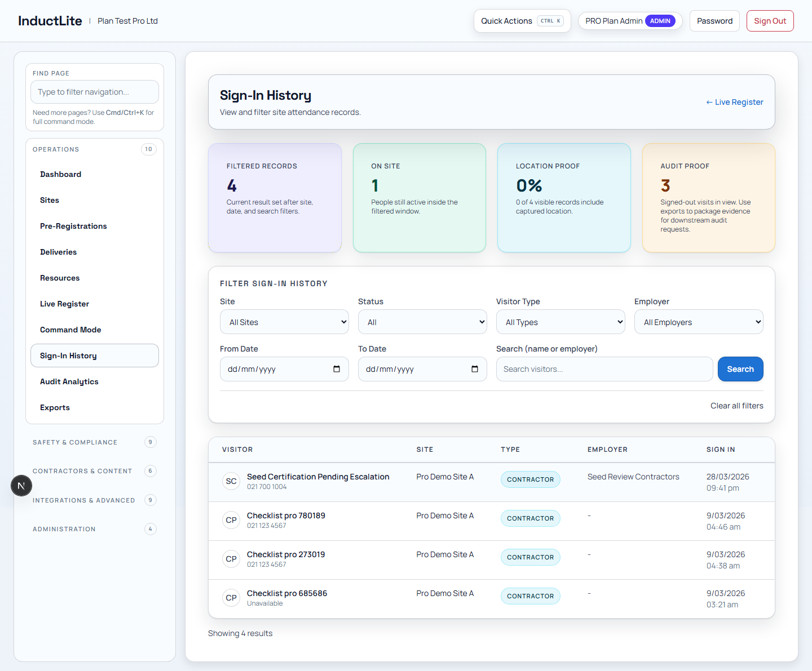
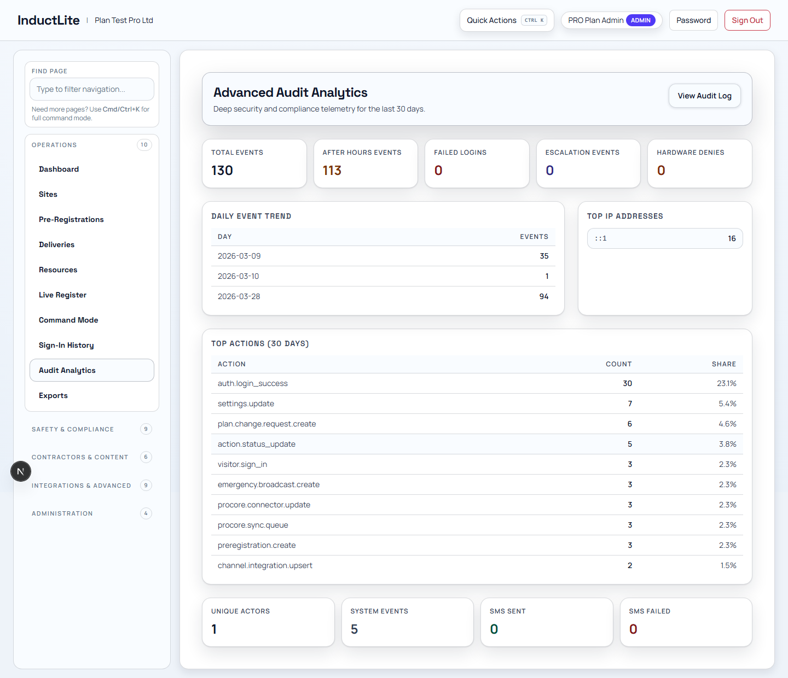
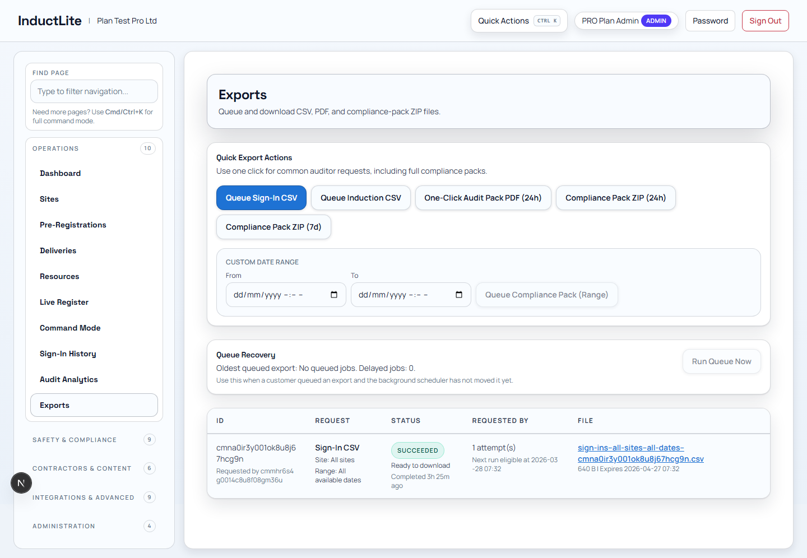

# Feature Guide Phase 2: Operations (2026-03-28)

Purpose: explain the day-to-day operating side of InductLite in plain language.

This phase covers the features that help a site team run live activity, track movement, and act on what is happening right now.

Related documents:

- [FEATURE_BY_FEATURE_EXPLANATION_PLAN_2026-03-28.md](./FEATURE_BY_FEATURE_EXPLANATION_PLAN_2026-03-28.md)
- [FEATURE_GUIDE_PHASE_1_PUBLIC_2026-03-28.md](./FEATURE_GUIDE_PHASE_1_PUBLIC_2026-03-28.md)
- [APP_TOUR_E2E_CERTIFICATION_PASS_2026-03-28.md](./APP_TOUR_E2E_CERTIFICATION_PASS_2026-03-28.md)

---

## 1. Why This Phase Matters

If the public sign-in flow is the front door, the Operations phase is the control room behind it.

This is where an operator can:

1. see what is happening across sites
2. manage active people, deliveries, and resources
3. intervene when something needs attention
4. produce operational records and exports

This is usually the easiest admin phase to explain after the public journey, because it answers the question:

> Once people sign in, what does the company actually do with that information?

---

## 2. Feature: Dashboard

### What this feature is

The dashboard is the operator home screen. It gives a quick picture of site activity, urgent work, and key operational health.

### Who uses it

- site managers
- operations leads
- control-room style coordinators
- admins checking the current state of the business

### Why it matters

It saves the operator from opening five separate pages just to understand what needs attention first.

### Typical workflow

1. open the dashboard at the start of a shift or check-in window
2. review the top summary cards
3. look at "Act now" items first
4. jump into the linked route that needs action

### Plain-language explanation

> This is the operating summary page. It tells the team what is happening now, what needs action, and where to go next.

---

## 3. Feature: Sites

### What this feature is

This page is the site register for the company. It lists sites, their addresses, public sign-in links, status, and management actions.

### Who uses it

- company admins
- operations managers
- people setting up or maintaining site access

### Why it matters

Sites are the backbone of the product. Everything else depends on having the right site structure.

### Typical workflow

1. search for a site
2. confirm its status and public entry link
3. activate or deactivate it if needed
4. use the link or site identity in downstream operations

### Plain-language explanation

> This is where the company manages the places people can sign into. It is the master site list, not just a directory.

---

## 4. Feature: Pre-Registrations

### What this feature is

This page is used to prepare people before they arrive. It handles invites, bulk upload, and pre-arrival access packs.

### Who uses it

- front desk teams
- site coordinators
- operations admins preparing visitors or contractors

### Why it matters

It reduces friction at the gate by getting information and links out before someone physically arrives.

### Typical workflow

1. create a single invite or upload many invites from CSV
2. send or copy the generated access link
3. use QR pack output if needed
4. deactivate an invite if plans change

### Plain-language explanation

> This feature lets the site team set people up before they arrive, so check-in is faster and more controlled.

---

## 5. Feature: Deliveries

### What this feature is

This page logs deliveries coming into a site and tracks their collection or completion state.

### Who uses it

- gate staff
- logistics coordinators
- site admins managing inbound materials

### Why it matters

Deliveries are often operationally important but poorly tracked. This gives a live queue instead of ad hoc notes.

### Typical workflow

1. register a delivery
2. track it in the queue
3. mark it collected or completed
4. use the record later if there is a dispute or audit question

### Plain-language explanation

> This is the live delivery book for a site, except it is digital, searchable, and tied to the rest of the operating record.

---

## 6. Feature: Resources

### What this feature is

This page manages bookable site resources such as rooms, equipment, or other shared operational assets.

### Who uses it

- site admins
- facilities teams
- coordinators assigning shared resources

### Why it matters

It helps stop clashes and gives the site team a clear view of who has booked what.

### Typical workflow

1. create or review a resource
2. create a booking for a time slot
3. confirm the booking state
4. use the booking list to avoid conflicts

### Plain-language explanation

> This is the scheduling layer for shared site resources, so they are managed as part of operations instead of by side messages.

---

## 7. Feature: Live Register

### What this feature is

This is the live occupancy and activity view. It shows who is on site, where attention is needed, and what the team should act on immediately.

### Who uses it

- site managers
- control-room staff
- emergency coordinators
- operations teams watching live movement

### Why it matters

This is one of the most operationally important pages in the product. It turns sign-ins into live awareness.

### Typical workflow

1. filter to a site or review all active sites
2. scan the summary and attention queue
3. open the detailed site view if something needs action
4. sign someone out or hand off into an incident if required

### Plain-language explanation

> This is the live people-on-site screen. It helps the operator answer, "Who is here, what needs attention, and what should I do next?"

---

## 8. Feature: Command Mode

### What this feature is

Command Mode is the high-pressure response surface for urgent site operations. It supports coordinated broadcast and roll-call style actions.

### Who uses it

- incident commanders
- site leads
- emergency response coordinators

### Why it matters

When something serious happens, the team needs a faster operational surface than normal admin pages.

### Typical workflow

1. open Command Mode during an operational event
2. create a broadcast or warning message
3. start a roll call or similar coordinated action
4. mark people accounted for and close the event state

### Plain-language explanation

> This is the emergency operating console. It is designed for moments when the team needs to coordinate quickly, not just browse data.

---

## 9. Feature: Sign-In History

### What this feature is

This is the historical ledger of sign-ins and sign-outs across the company or selected site.

### Who uses it

- admins checking past attendance
- compliance teams
- investigators reviewing site presence later

### Why it matters

A live register tells you what is happening now. History tells you what happened before.

### Typical workflow

1. filter by status or search by name
2. review historical rows
3. sign someone out if a live record still needs closure
4. use the table as evidence in a later review

### Plain-language explanation

> This is the searchable historical record of who came on site, when they were there, and what their final status was.

---

## 10. Feature: Audit Analytics

### What this feature is

This route turns operational and audit activity into trends, totals, and management-level reporting views.

### Who uses it

- compliance leads
- operations managers
- company admins

### Why it matters

It helps leadership understand activity patterns rather than just reviewing one event at a time.

### Typical workflow

1. open the route after a period of activity
2. review summary totals and recent patterns
3. identify where activity is increasing or recurring
4. use the route to support operational review or reporting

### Plain-language explanation

> This is the "what do the records tell us over time?" page. It is more about trend visibility than live action.

---

## 11. Feature: Exports

### What this feature is

This page manages export jobs for records such as sign-in data and operational snapshots.

### Who uses it

- compliance teams
- admins preparing reports
- managers responding to external information requests

### Why it matters

Sometimes the business needs a file, not just a screen. This is where those exportable records are generated and tracked.

### Typical workflow

1. queue an export
2. monitor the export state
3. download the resulting file when ready
4. keep a record that the export was generated

### Plain-language explanation

> This is the controlled file-output feature for the system. It is how operational data leaves the app in a structured, auditable way.

---

## 12. How To Explain The Whole Operations Phase To Someone

If you need a short talk track, you can say:

> The Operations side of InductLite is where the company runs the live site day to day. It covers the dashboard, the site list, pre-arrival setup, live people tracking, urgent command workflows, history, analytics, and exports.

## 13. What Comes Next

The next phase is Safety & Compliance, which explains how the product manages hazards, incidents, actions, inspections, permits, approvals, and communications.
