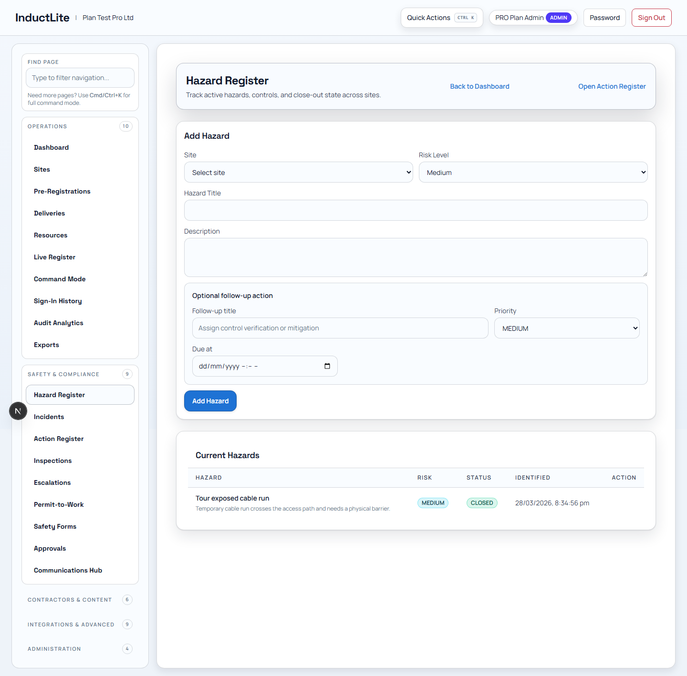
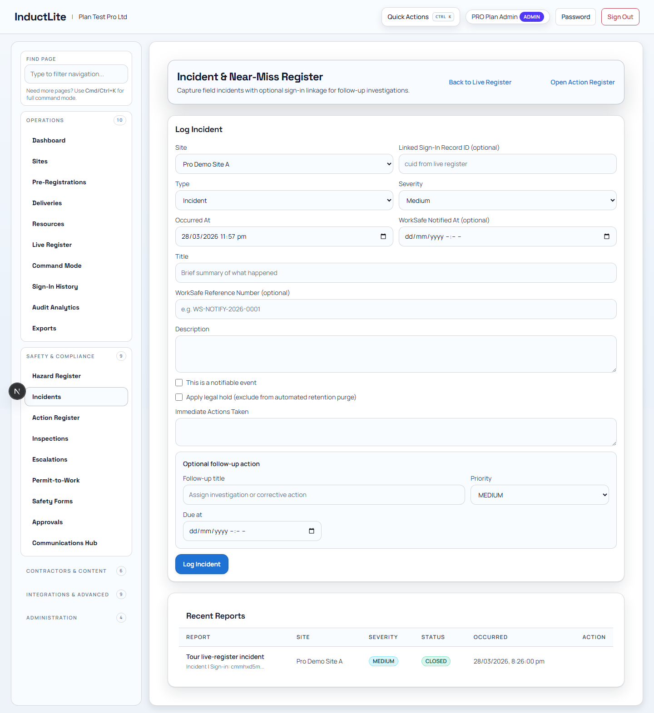
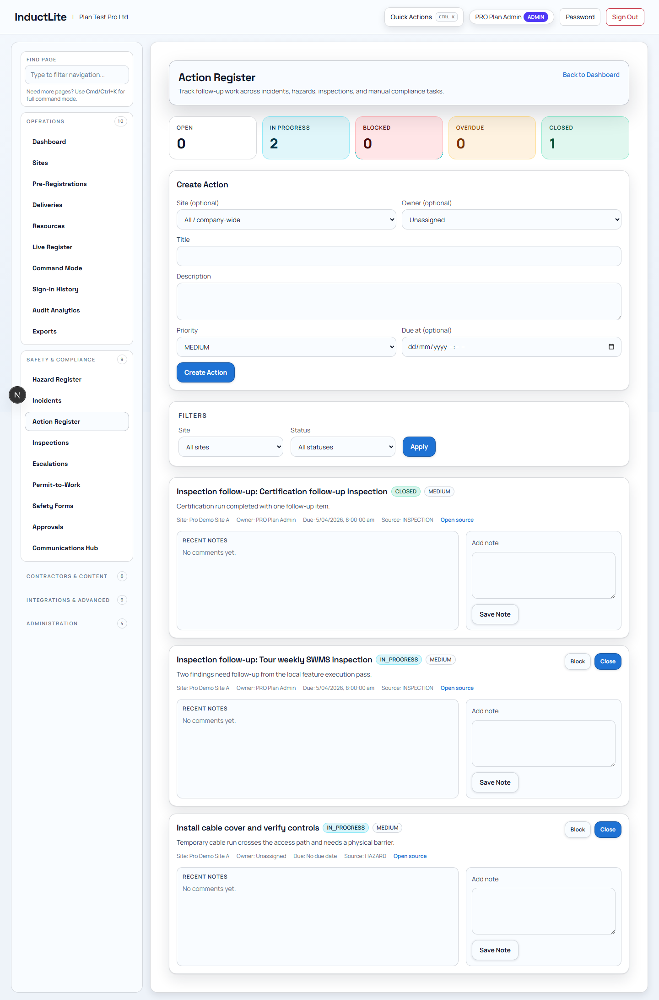
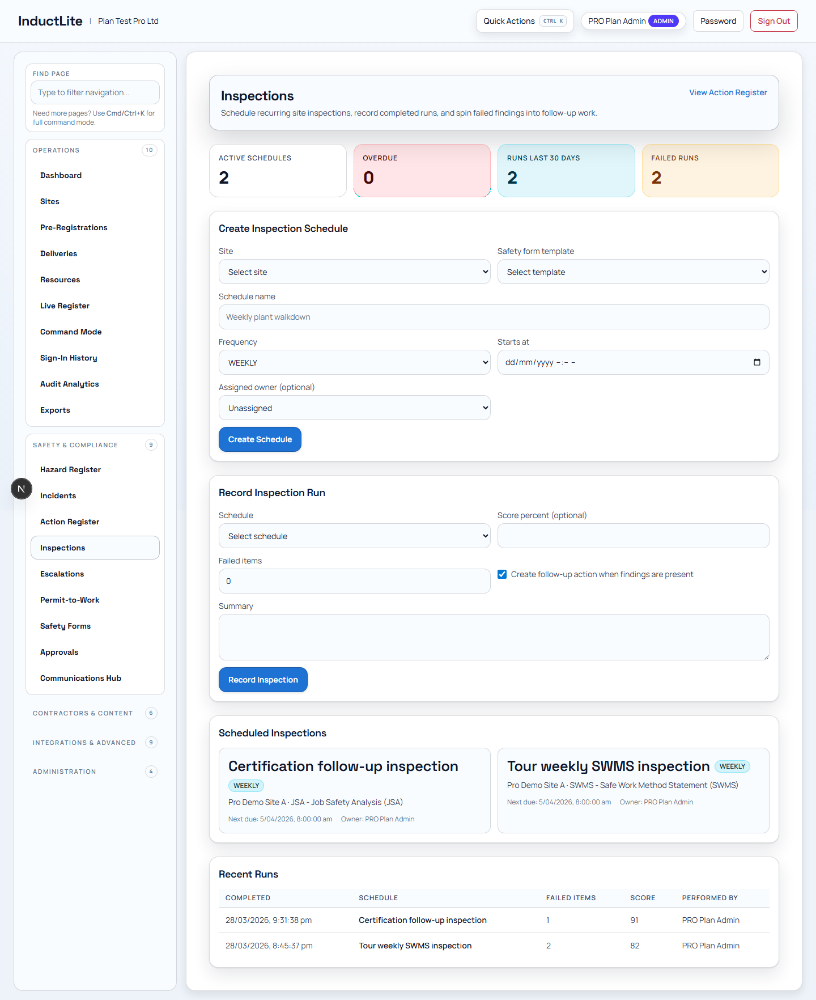
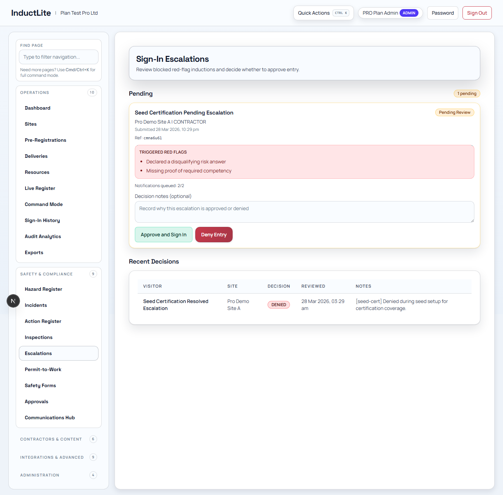
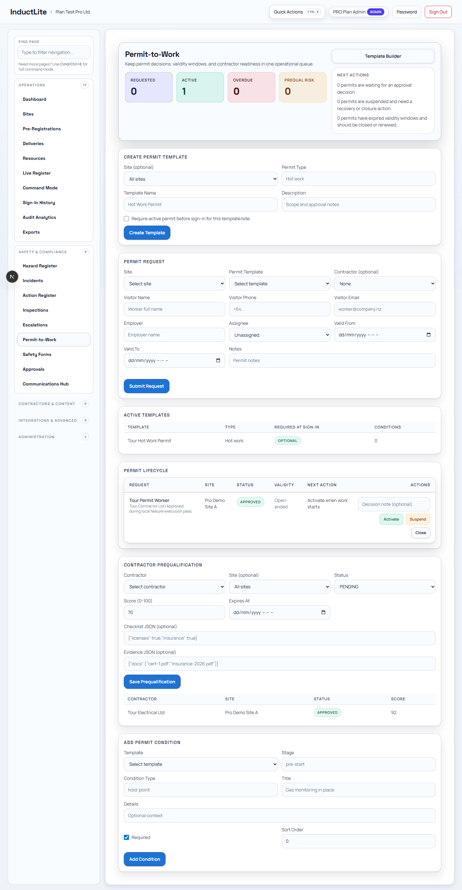
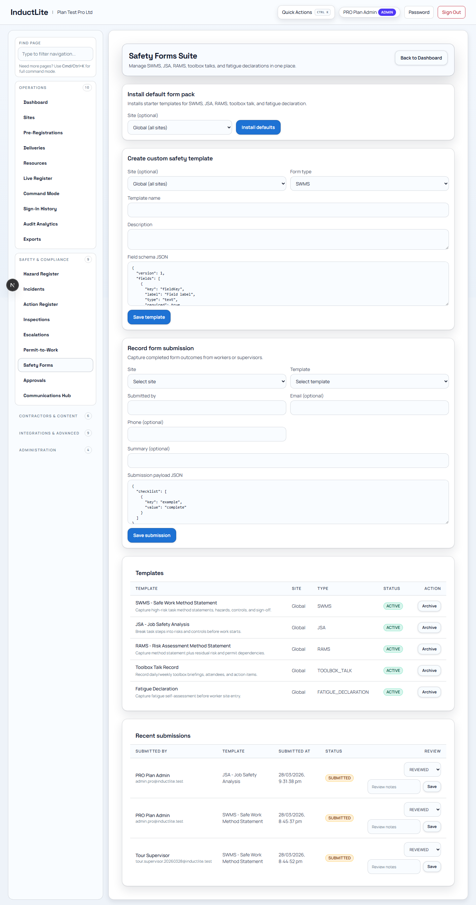
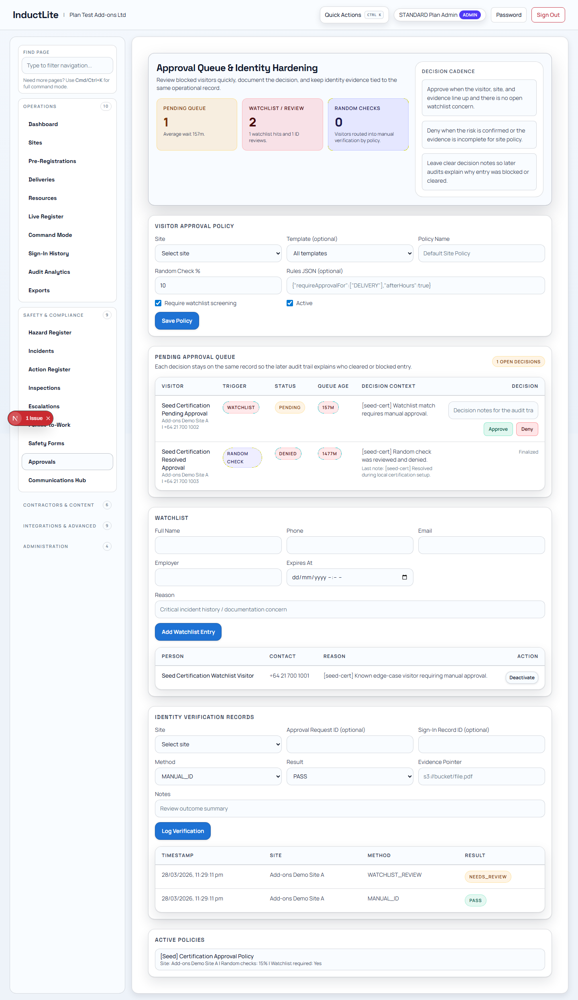
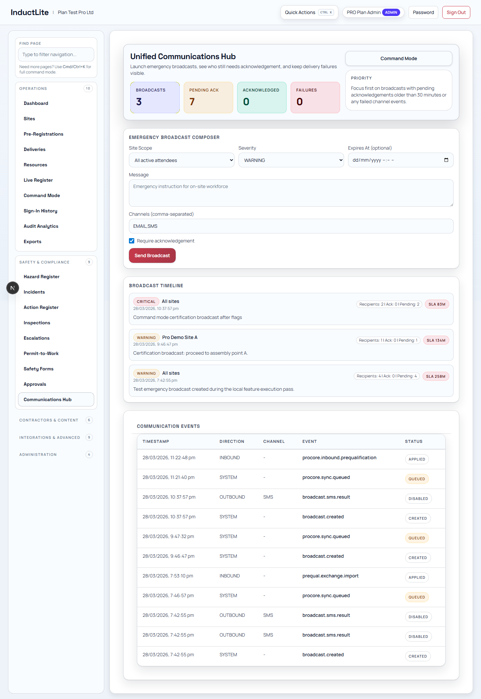

# Feature Guide Phase 3: Safety & Compliance (2026-03-28)

Purpose: explain the parts of InductLite that handle site safety, compliance control, and evidence-backed operational decisions.

Related documents:

- [FEATURE_BY_FEATURE_EXPLANATION_PLAN_2026-03-28.md](./FEATURE_BY_FEATURE_EXPLANATION_PLAN_2026-03-28.md)
- [FEATURE_GUIDE_PHASE_2_OPERATIONS_2026-03-28.md](./FEATURE_GUIDE_PHASE_2_OPERATIONS_2026-03-28.md)
- [APP_TOUR_E2E_CERTIFICATION_PASS_2026-03-28.md](./APP_TOUR_E2E_CERTIFICATION_PASS_2026-03-28.md)

---

## 1. Why This Phase Matters

Operations tells you what is happening.

Safety & Compliance tells you:

1. what is risky
2. what needs follow-up
3. what must be approved
4. what evidence exists if something goes wrong

This phase is important when explaining the app to someone who asks:

> Is this just a sign-in tool, or does it actually help manage site risk?

---

## 2. Feature: Hazard Register

### What this feature is

The Hazard Register is where site hazards are logged, tracked, and closed out.

### Who uses it

- safety managers
- supervisors
- site admins
- workers who need hazards recorded and followed up

### Why it matters

It turns safety concerns into tracked records rather than informal memory or paper notes.

### Typical workflow

1. log a hazard
2. attach the right site and context
3. assign or create a follow-up action
4. close it once resolved

### Plain-language explanation

> This is the working hazard book for the site, but digital, searchable, and tied to follow-up.

---

## 3. Feature: Incidents

### What this feature is

This route manages incident reports from creation through close-out.

### Who uses it

- safety teams
- operations managers
- site leaders handling real incidents

### Why it matters

If something serious happens, the team needs a traceable incident record with proper follow-up and context.

### Typical workflow

1. create an incident directly or from a live-register handoff
2. capture the site and people involved
3. review and update the incident
4. close it once handled

### Plain-language explanation

> This is where a real event becomes a formal operational and compliance record.

---

## 4. Feature: Action Register

### What this feature is

The Action Register tracks follow-up work that needs to move from open to complete.

### Who uses it

- safety teams
- managers assigning corrective action
- operations staff following up on issues

### Why it matters

A finding without an action is easy to forget. This makes follow-up visible and measurable.

### Typical workflow

1. create or review an action
2. start work on it
3. block it if something prevents progress
4. close it when done

### Plain-language explanation

> This is the task register for safety and compliance follow-up, with status transitions that show progress clearly.

---

## 5. Feature: Inspections

### What this feature is

This feature schedules and records inspections.

### Who uses it

- inspectors
- safety managers
- site supervisors

### Why it matters

It gives the company evidence that inspections are being planned and completed, not just discussed.

### Typical workflow

1. create an inspection schedule
2. perform or record the inspection run
3. review the result in the route
4. tie any findings back into actions or incidents if needed

### Plain-language explanation

> This is the schedule-and-record system for site inspections, so inspections become part of the live operating record.

---

## 6. Feature: Escalations

### What this feature is

Escalations is the decision queue for cases that need a stronger operational or compliance response.

### Who uses it

- senior operators
- compliance leads
- managers making approval or risk decisions

### Why it matters

Some issues should not be resolved casually at the front line. This route captures those higher-level decisions.

### Typical workflow

1. open the pending escalation queue
2. review the context and evidence
3. approve or deny with a note
4. let the decision flow back into the live operating record

### Plain-language explanation

> This is where the harder cases go when the decision needs to be explicit, documented, and reviewable later.

---

## 7. Feature: Permit-to-Work

### What this feature is

This module manages permit templates, requests, and approvals for controlled work.

### Who uses it

- permit issuers
- site safety managers
- contractors requesting controlled work access

### Why it matters

High-risk work should not run on verbal permission alone. This feature formalizes it.

### Typical workflow

1. create or maintain a permit template
2. submit a permit request
3. review and approve the request
4. use the approved permit as a controlled work record

### Plain-language explanation

> This is the permit workflow for work that needs explicit safety control before it starts.

---

## 8. Feature: Safety Forms

### What this feature is

Safety Forms manages reusable forms and form submissions for site safety workflows.

### Who uses it

- safety admins
- site leads
- teams collecting structured safety information

### Why it matters

It gives the business a standard way to collect safety information without rebuilding the same form each time.

### Typical workflow

1. install or manage form templates
2. submit a form against a site or workflow
3. review recent submissions
4. use the records later for follow-up or audit

### Plain-language explanation

> This is the reusable form engine for safety processes, so the team can collect structured records consistently.

---

## 9. Feature: Approvals

### What this feature is

This route handles manual approvals, watchlist review, and identity-hardening decisions before access is allowed.

### Who uses it

- compliance teams
- security or access control teams
- admins reviewing edge cases

### Why it matters

Not every visitor or contractor should be waved through automatically. Some need review.

### Typical workflow

1. define an approval policy
2. review the pending queue
3. approve or deny with decision notes
4. keep watchlist and verification records tied to the same operational history

### Plain-language explanation

> This is where the company handles the exceptions - the people or cases that need human judgment before entry is cleared.

---

## 10. Feature: Communications Hub

### What this feature is

Communications Hub manages broadcasts and operational messages.

### Who uses it

- site leaders
- incident coordinators
- operations teams who need to communicate quickly

### Why it matters

When the team needs to alert people fast, the message should come from the system of record, not a scattered chat thread.

### Typical workflow

1. compose a broadcast
2. choose the right channel or destination
3. send it
4. verify it appears in the operational timeline and delivery history

### Plain-language explanation

> This is the broadcast layer of the product. It turns urgent communication into a controlled, traceable operational event.

---

## 11. How To Explain The Whole Safety & Compliance Phase

You can describe this phase like this:

> Safety & Compliance is where InductLite stops being just a movement system and becomes a risk-control system. It handles hazards, incidents, actions, inspections, escalations, permits, approvals, forms, and communications in one auditable operating model.

## 12. What Comes Next

The next phase is Contractors & Content, which explains contractor readiness, content governance, competency, trust, and benchmarking.
