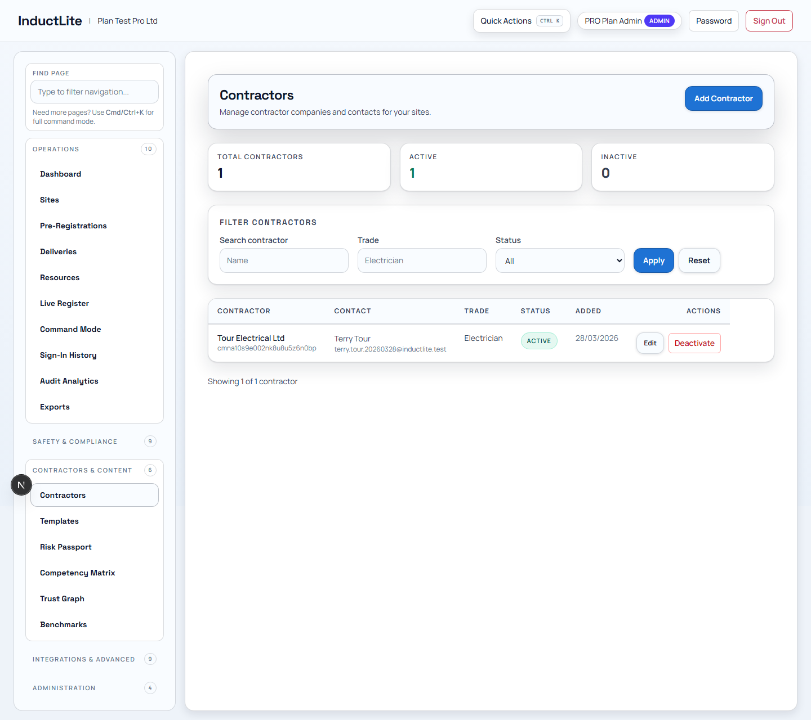
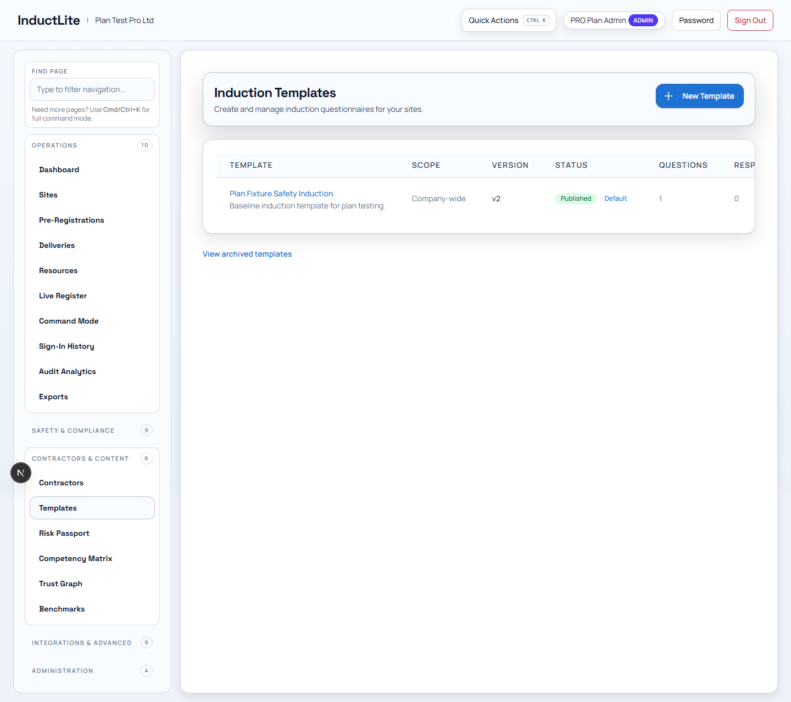
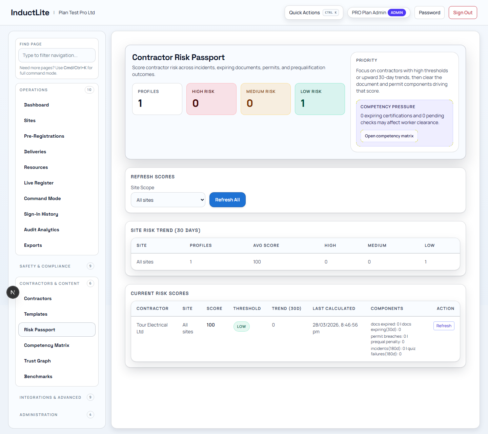
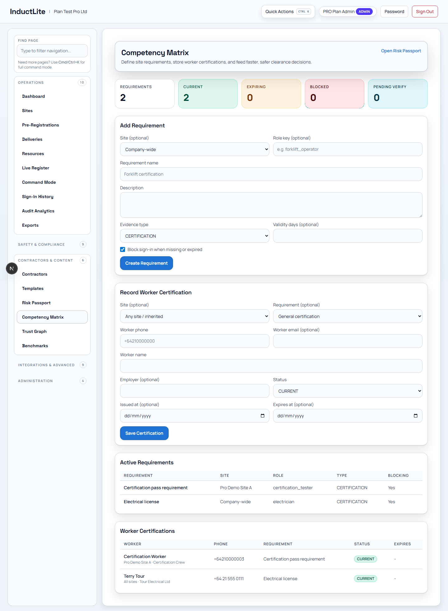
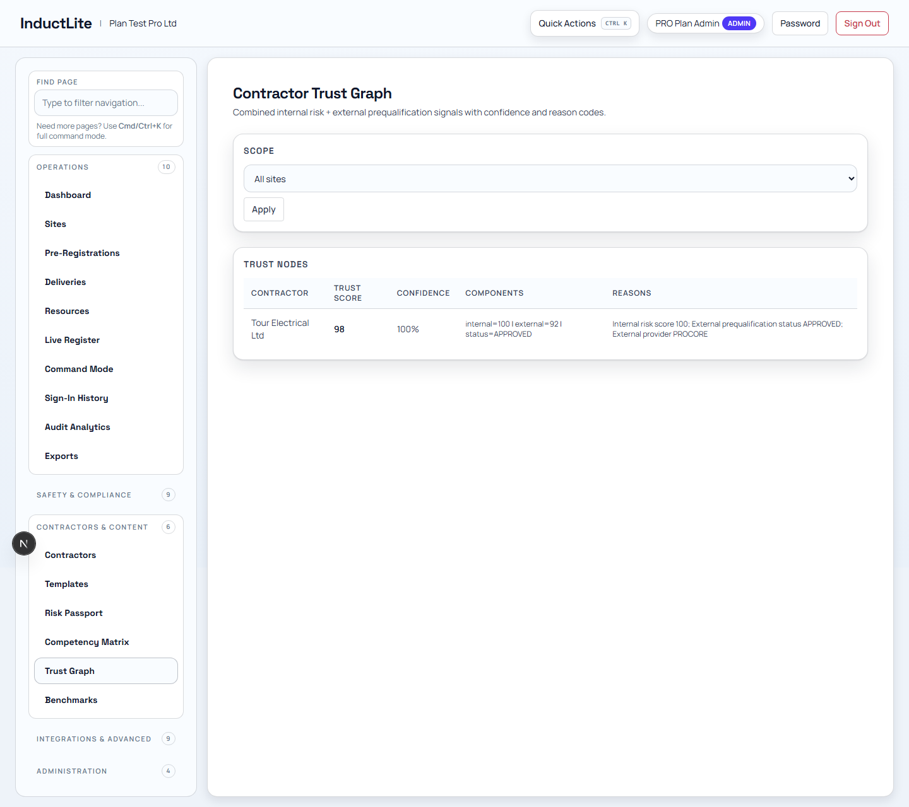
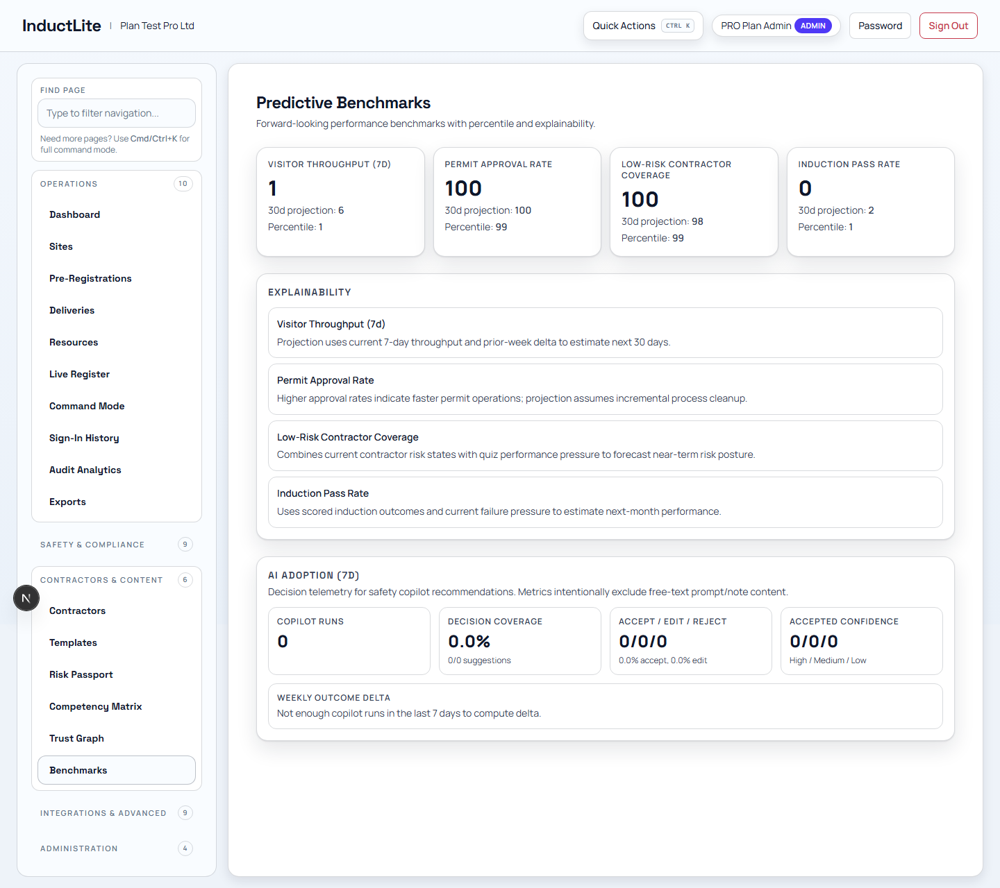

# Feature Guide Phase 4: Contractors & Content (2026-03-28)

Purpose: explain how InductLite manages contractor readiness, reusable content, capability records, and performance or risk views.

Related documents:

- [FEATURE_BY_FEATURE_EXPLANATION_PLAN_2026-03-28.md](./FEATURE_BY_FEATURE_EXPLANATION_PLAN_2026-03-28.md)
- [FEATURE_GUIDE_PHASE_3_SAFETY_COMPLIANCE_2026-03-28.md](./FEATURE_GUIDE_PHASE_3_SAFETY_COMPLIANCE_2026-03-28.md)
- [APP_TOUR_E2E_CERTIFICATION_PASS_2026-03-28.md](./APP_TOUR_E2E_CERTIFICATION_PASS_2026-03-28.md)

---

## 1. Why This Phase Matters

This phase explains how the company manages the people and content behind the site workflow.

It answers questions like:

- Which contractors are ready to work?
- Which induction or safety templates are active?
- Which people are certified?
- Which contractors look risky or trustworthy?

---

## 2. Feature: Contractors

### What this feature is

This is the contractor master register. It stores contractor organisations and their working status.

### Who uses it

- company admins
- compliance teams
- contractor management teams

### Why it matters

Contractors are central to most site activity. The business needs a clear record of who they are and whether they are active.

### Typical workflow

1. create a contractor
2. review or update contractor details
3. deactivate when needed
4. reactivate when the relationship resumes

### Plain-language explanation

> This is the company list for the external organisations working with the site network.

---

## 3. Feature: Templates

### What this feature is

Templates manages versioned content used in inductions or related controlled workflows.

### Who uses it

- content owners
- compliance teams
- admins responsible for keeping official wording current

### Why it matters

Important content needs governance. A company should know what version is live and when it changed.

### Typical workflow

1. open a template
2. create a new draft version
3. publish the approved version
4. rely on the active version in downstream workflows

### Plain-language explanation

> This is the content-governance layer for the operational forms and inductions people see.

---

## 4. Feature: Risk Passport

### What this feature is

Risk Passport gives a summarized risk view for contractors or related working entities.

### Who uses it

- contractor managers
- compliance leads
- ops teams checking readiness and risk posture

### Why it matters

It helps the business turn scattered risk signals into a usable high-level view.

### Typical workflow

1. refresh the current scores
2. review contractor-level outputs
3. use the result to guide approval or readiness decisions

### Plain-language explanation

> This is the quick-read risk card for contractor readiness, rather than making someone inspect every underlying record by hand.

---

## 5. Feature: Competency

### What this feature is

This feature manages competency requirements and stored certifications.

### Who uses it

- training coordinators
- compliance teams
- contractor managers

### Why it matters

Before someone is cleared to work, the company may need proof they hold specific skills or certifications.

### Typical workflow

1. create a competency requirement
2. record a worker certification
3. use the stored record during readiness or access checks

### Plain-language explanation

> This is where the company proves people have the right qualifications before they work on site.

---

## 6. Feature: Trust Graph

### What this feature is

Trust Graph is a higher-level view of contractor trust or confidence across site contexts.

### Who uses it

- senior compliance teams
- contractor governance leads
- managers comparing readiness across multiple contractors or sites

### Why it matters

It helps the business understand trust and confidence as a pattern, not just a one-off score.

### Typical workflow

1. review the current trust view
2. change scope to another site if needed
3. compare confidence and reason mix across contexts

### Plain-language explanation

> This is the relationship-and-confidence view for contractor trust, useful when the team wants a bigger picture than a single checklist.

---

## 7. Feature: Benchmarks

### What this feature is

Benchmarks is the comparative and explainability view for higher-level operational performance signals.

### Who uses it

- leadership
- strategy or operations analysts
- admins looking for comparative insight

### Why it matters

It helps the business compare itself against modeled or benchmarked patterns rather than only looking at raw counts.

### Typical workflow

1. open the route after enough activity exists
2. review benchmark metrics and explainability panels
3. use the results in planning or review conversations

### Plain-language explanation

> This is the "how are we tracking compared with a broader model?" page, not just a live operations tool.

---

## 8. How To Explain The Whole Contractors & Content Phase

You can describe this phase like this:

> This part of InductLite manages the organisations, content, qualifications, and risk signals that sit behind site access. It helps the company decide not just who is present, but who is ready and trustworthy enough to be there.

## 9. What Comes Next

The next phase is Integrations & Advanced, which covers webhooks, channels, Procore, mobile runtime, access operations, evidence, and policy simulation.
