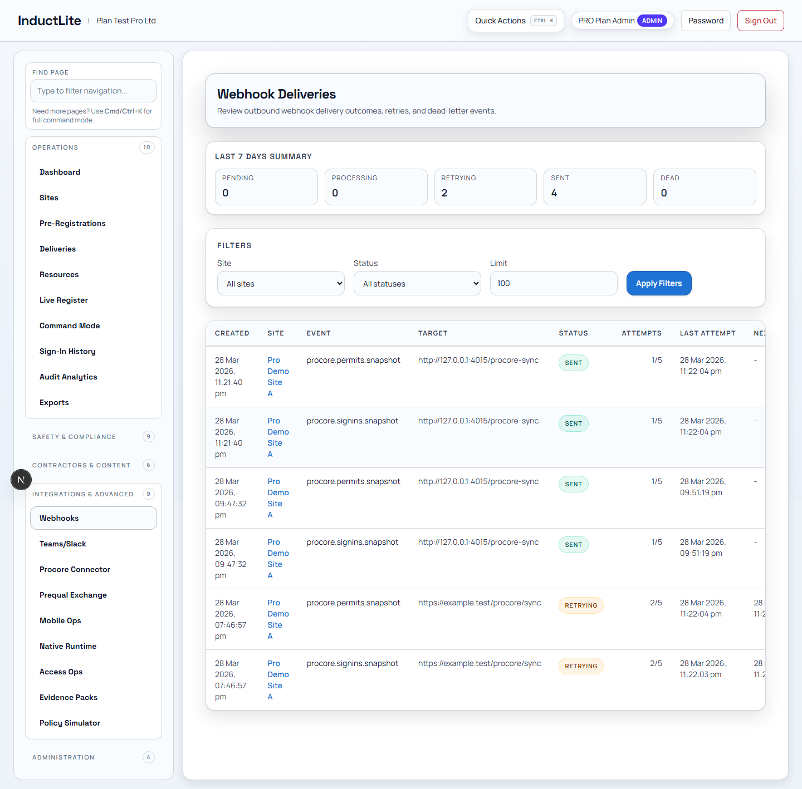
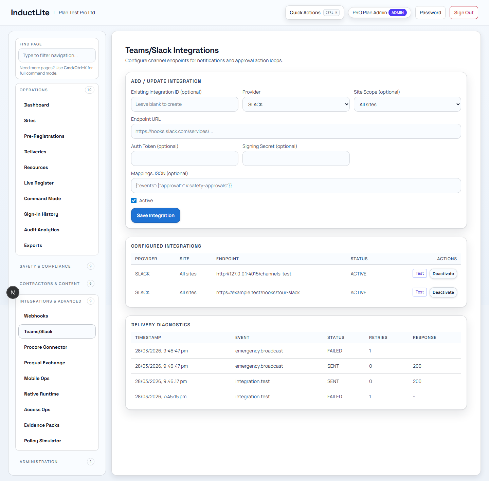
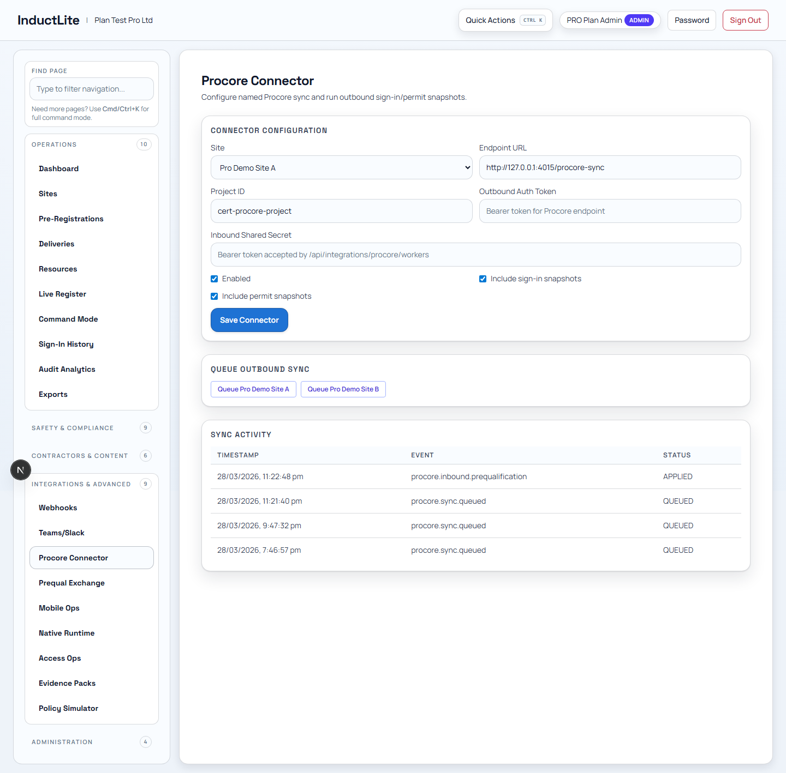
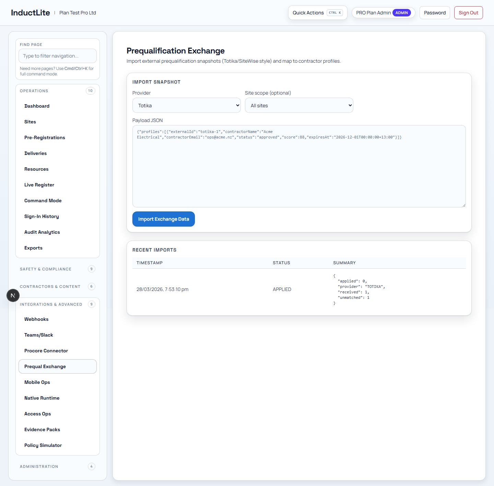
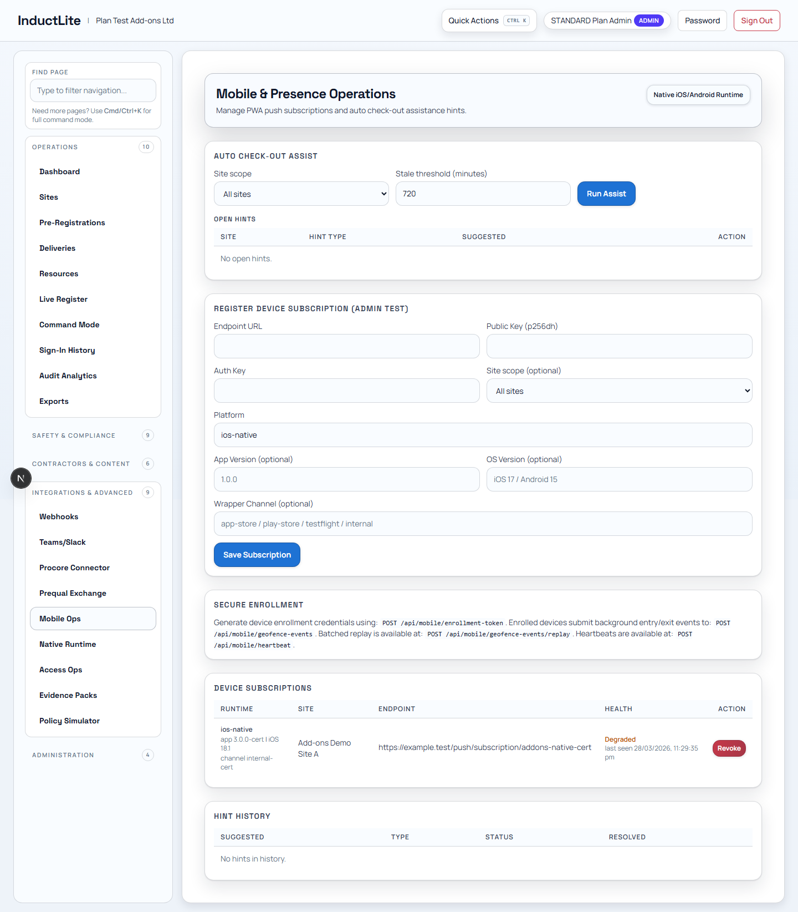
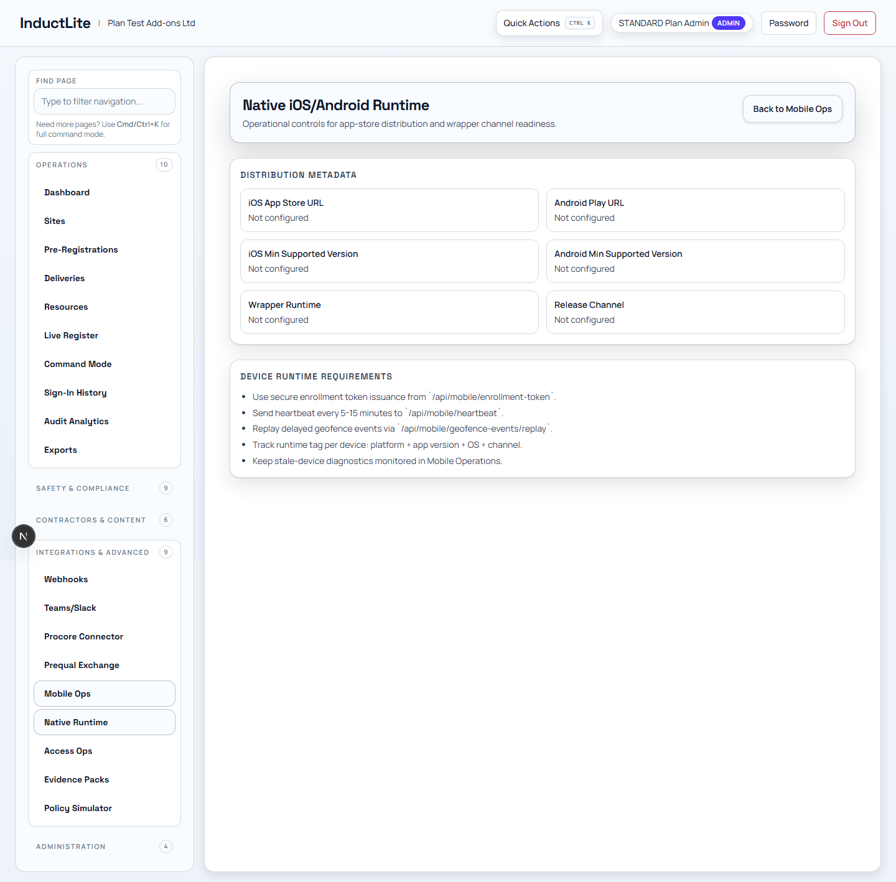
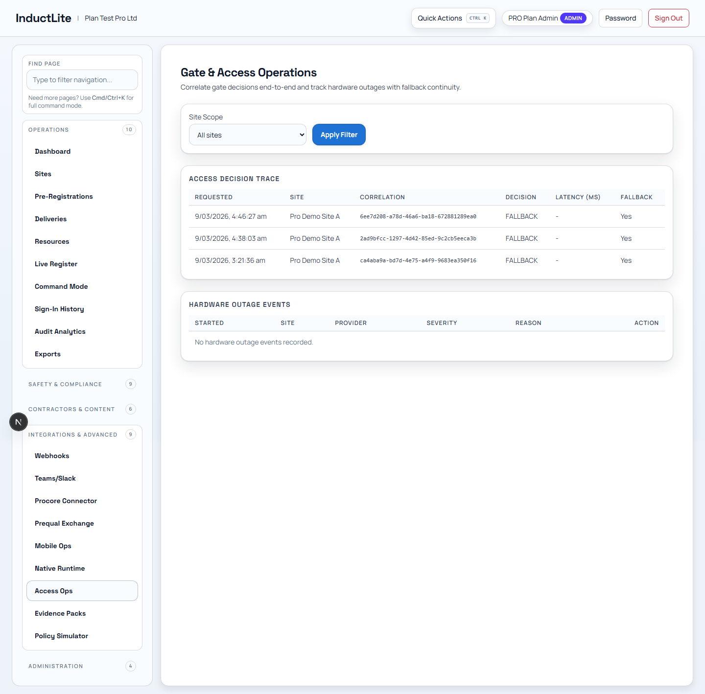
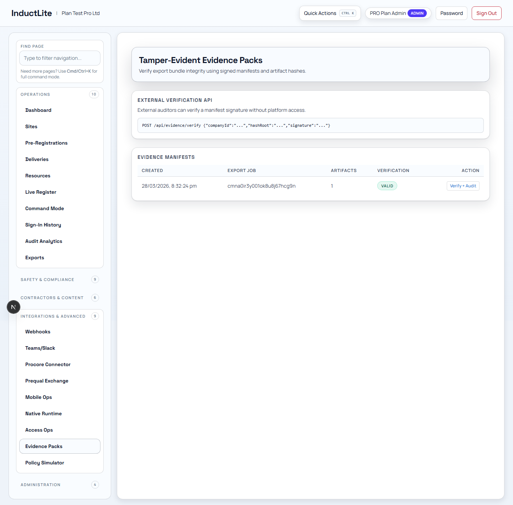
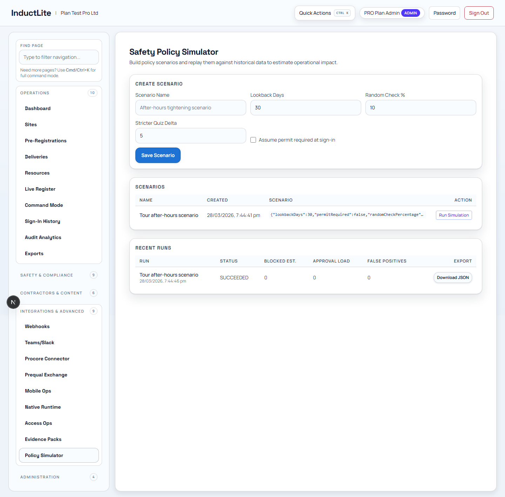

# Feature Guide Phase 5: Integrations & Advanced (2026-03-28)

Purpose: explain the advanced and integration-heavy parts of InductLite in plain language.

Related documents:

- [FEATURE_BY_FEATURE_EXPLANATION_PLAN_2026-03-28.md](./FEATURE_BY_FEATURE_EXPLANATION_PLAN_2026-03-28.md)
- [FEATURE_GUIDE_PHASE_4_CONTRACTORS_CONTENT_2026-03-28.md](./FEATURE_GUIDE_PHASE_4_CONTRACTORS_CONTENT_2026-03-28.md)
- [APP_TOUR_E2E_CERTIFICATION_PASS_2026-03-28.md](./APP_TOUR_E2E_CERTIFICATION_PASS_2026-03-28.md)
- [EXTERNAL_CERTIFICATION_CHECKLIST_2026-03-28.md](./EXTERNAL_CERTIFICATION_CHECKLIST_2026-03-28.md)

---

## 1. Why This Phase Matters

These features show that InductLite is not only an internal workflow tool.

It can also:

1. connect to other systems
2. send and receive operational events
3. support mobile-runtime flows
4. generate auditable evidence
5. simulate policy behavior before rollout

---

## 2. Feature: Webhooks

### What this feature is

Webhooks is the delivery-monitoring view for outbound event traffic.

### Who uses it

- technical admins
- integration owners
- operations teams checking delivery health

### Why it matters

When the app sends information to another system, someone needs to know whether it was delivered, retried, or failed.

### Typical workflow

1. open the delivery monitor
2. review queued, sent, or retrying deliveries
3. confirm the integration health after an operational event

### Plain-language explanation

> This is the shipping log for system-to-system events leaving InductLite.

---

## 3. Feature: Teams/Slack Channels

### What this feature is

This page configures channel-based integrations for messages and test events.

### Who uses it

- technical admins
- communications owners
- operations teams connecting alert channels

### Why it matters

It connects the operational system to the team communication tools people already use.

### Typical workflow

1. save a channel integration
2. send a test event
3. reuse the integration from a live broadcast route

### Plain-language explanation

> This is how the product talks to shared messaging channels outside the app.

---

## 4. Feature: Procore Connector

### What this feature is

This feature connects InductLite with Procore-style project and contractor data flows.

### Who uses it

- integration admins
- enterprise customers
- teams needing project-system interoperability

### Why it matters

Large customers often do not want site access data trapped in one tool. They want it to flow into existing project systems.

### Typical workflow

1. save connector settings
2. queue outbound sync
3. monitor delivery
4. accept inbound profile or qualification data
5. confirm the resulting record appears in the app

### Plain-language explanation

> This is the bridge between InductLite and a project system like Procore, so site-readiness information can move both ways.

### Important note

The app is locally certified for this feature, and the next optional step later is real partner-sandbox acceptance proof. That deferred checklist is documented in [EXTERNAL_CERTIFICATION_CHECKLIST_2026-03-28.md](./EXTERNAL_CERTIFICATION_CHECKLIST_2026-03-28.md).

---

## 5. Feature: Prequalification Exchange

### What this feature is

This route imports external prequalification data snapshots.

### Who uses it

- compliance teams
- contractor governance teams
- admins importing partner data

### Why it matters

Contractor approval often depends on external readiness signals. This feature brings those into the product instead of leaving them disconnected.

### Typical workflow

1. import a snapshot
2. review the processing result
3. identify matched or unmatched contractors

### Plain-language explanation

> This is the intake point for contractor qualification data coming from outside systems.

---

## 6. Feature: Mobile Ops

### What this feature is

This is the admin-side control surface for mobile assist behavior and mobile subscriptions.

### Who uses it

- mobile operations admins
- access-control teams
- technical operators managing mobile hints or subscriptions

### Why it matters

It lets the company manage app-assisted mobility features without treating them as a black box.

### Typical workflow

1. review assist hints
2. accept or dismiss them
3. save or revoke admin-side subscriptions
4. use the route to supervise mobile operations

### Plain-language explanation

> This is the admin control room for the mobile side of the product.

---

## 7. Feature: Native Runtime

### What this feature is

This route and runtime support device enrollment, bootstrap, heartbeat, and geofence-aware native flows.

### Who uses it

- technical admins
- mobile/runtime teams
- enterprise customers using native device-assisted workflows

### Why it matters

It proves that the app can move beyond browser-based workflows into native-runtime assisted access control.

### Typical workflow

1. create a device subscription
2. issue an enrollment token
3. bootstrap the device
4. receive heartbeat and event traffic
5. confirm event handling and replay protection

### Plain-language explanation

> This is the infrastructure that lets a real mobile device behave like an active participant in the site-access system, not just a passive browser.

### Important note

The app is locally certified for this feature, and the later optional step is real device-lane acceptance proof. That deferred checklist is documented in [EXTERNAL_CERTIFICATION_CHECKLIST_2026-03-28.md](./EXTERNAL_CERTIFICATION_CHECKLIST_2026-03-28.md).

---

## 8. Feature: Access Ops

### What this feature is

Access Ops is the operational trace and visibility page for access-related events.

### Who uses it

- access-control teams
- operations leads
- troubleshooting staff

### Why it matters

When the business needs to understand why someone was or was not granted access, trace visibility matters.

### Typical workflow

1. filter to a site
2. review the access trace
3. compare a populated site with an empty or quiet site
4. use the route to understand access behavior

### Plain-language explanation

> This is the trace page that helps explain the access story behind the scenes.

---

## 9. Feature: Evidence Packs

### What this feature is

Evidence Packs verifies or audits bundled evidence records.

### Who uses it

- compliance teams
- auditors
- admins who need a stronger proof trail

### Why it matters

In sensitive environments, the business may need more than ordinary records. It may need verifiable evidence packages.

### Typical workflow

1. open an evidence manifest
2. run verification or audit
3. review signature and integrity results

### Plain-language explanation

> This is the tamper-confidence layer for important evidence, making records easier to trust later.

---

## 10. Feature: Policy Simulator

### What this feature is

Policy Simulator lets the team model the effect of policy choices before applying them broadly.

### Who uses it

- compliance leads
- ops designers
- product or rollout teams

### Why it matters

Good operators often want to test a rule before it affects the real workflow.

### Typical workflow

1. create a scenario
2. run the simulation
3. review the outcome and export if needed

### Plain-language explanation

> This is the "what would happen if we changed the rules?" feature.

---

## 11. How To Explain The Whole Integrations & Advanced Phase

You can describe this phase like this:

> These features show that InductLite is not just a closed admin panel. It can send events out, take data in, connect to project systems, support mobile-runtime flows, verify evidence, and model policy changes before rollout.

## 12. What Comes Next

The next phase is Administration, which covers users, audit log, settings, and plan configuration.
