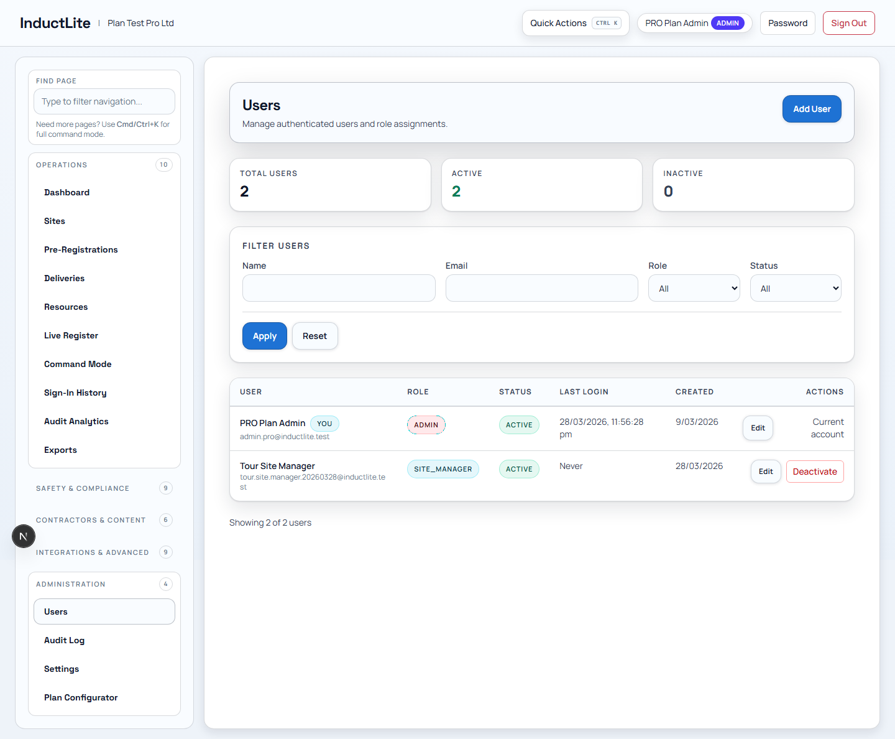
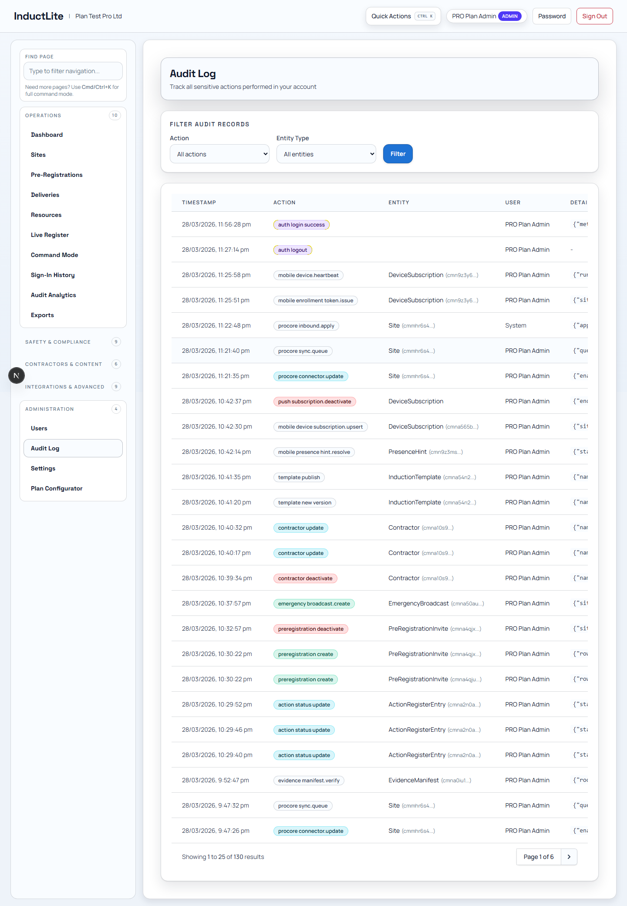
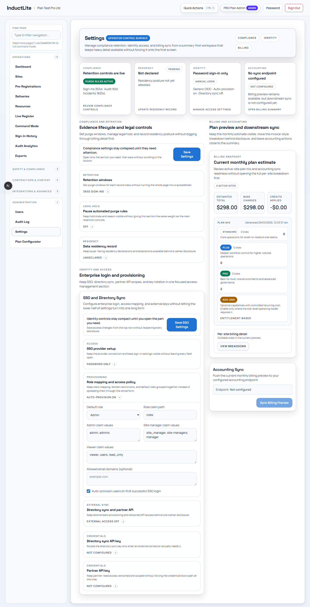
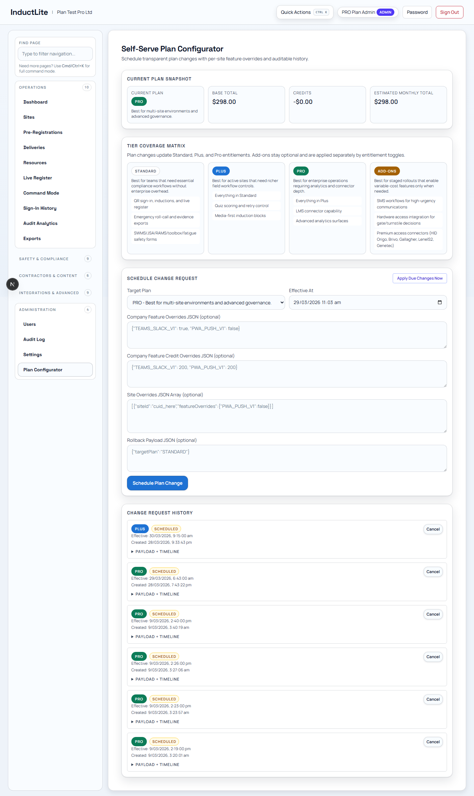

# Feature Guide Phase 6: Administration (2026-03-28)

Purpose: explain the governance and control features that let a company manage access, settings, history, and plan-level configuration.

Related documents:

- [FEATURE_BY_FEATURE_EXPLANATION_PLAN_2026-03-28.md](./FEATURE_BY_FEATURE_EXPLANATION_PLAN_2026-03-28.md)
- [FEATURE_GUIDE_PHASE_5_INTEGRATIONS_ADVANCED_2026-03-28.md](./FEATURE_GUIDE_PHASE_5_INTEGRATIONS_ADVANCED_2026-03-28.md)
- [APP_TOUR_E2E_CERTIFICATION_PASS_2026-03-28.md](./APP_TOUR_E2E_CERTIFICATION_PASS_2026-03-28.md)

---

## 1. Why This Phase Matters

Administration is the company-control layer of the app.

It answers questions like:

- Who can use the system?
- What rules are configured?
- What changed, and when?
- Which commercial or plan settings are in effect?

---

## 2. Feature: Users

### What this feature is

This route manages internal users and their active state.

### Who uses it

- company admins
- system administrators
- managers controlling internal access

### Why it matters

The business needs a controlled way to add, deactivate, and restore operator accounts.

### Typical workflow

1. create a user
2. assign the right role or scope
3. deactivate when access should stop
4. reactivate if the person returns

### Plain-language explanation

> This is the internal user roster for the company side of the product.

---

## 3. Feature: Audit Log

### What this feature is

The Audit Log is the event ledger for important admin and system actions.

### Who uses it

- compliance teams
- admins investigating changes
- internal reviewers who need traceability

### Why it matters

If someone asks, "Who changed this?" or "When did that happen?", this route should answer it.

### Typical workflow

1. filter by action or entity
2. page through recent records
3. use the audit trail for investigation or reporting

### Plain-language explanation

> This is the traceability record for administrative activity inside the product.

---

## 4. Feature: Settings

### What this feature is

Settings is the company-level configuration surface for compliance, identity, and billing-related controls.

### Who uses it

- company admins
- compliance leads
- identity or IT admins

### Why it matters

This is where the company defines how the product should behave for its own environment.

### Typical workflow

1. review the summary cards and main sections
2. open the relevant disclosure group
3. make a configuration change
4. save and confirm the new value persists

### Plain-language explanation

> This is the main control panel for company-wide policy and identity settings.

---

## 5. Feature: Plan Configurator

### What this feature is

This route manages scheduled plan or packaging changes inside the product.

### Who uses it

- company admins
- internal operators managing rollout or commercial state
- support or operations teams with plan-management responsibility

### Why it matters

Some organisations need plan changes to be controlled and scheduled rather than changed informally.

### Typical workflow

1. create a scheduled change
2. confirm it is written to the history
3. use the record to manage rollout timing

### Plain-language explanation

> This is the controlled plan-change page, so commercial or packaging changes happen through a visible recorded process.

---

## 6. How To Explain The Whole Administration Phase

You can describe this phase like this:

> Administration is the governance layer of InductLite. It manages internal users, company settings, the audit trail, and scheduled plan changes so the business can control the platform properly.

## 7. Completing The Feature Guide Pack

At this point, the plain-language feature guide phases are complete:

1. Public Journey
2. Operations
3. Safety & Compliance
4. Contractors & Content
5. Integrations & Advanced
6. Administration

## 8. Deferred Follow-Up To Remember

After the handbook and screenshot pack are complete, come back to:

- [EXTERNAL_CERTIFICATION_CHECKLIST_2026-03-28.md](./EXTERNAL_CERTIFICATION_CHECKLIST_2026-03-28.md)

Specifically for:

1. real Procore sandbox certification
2. real iOS/Android wrapper/device certification
